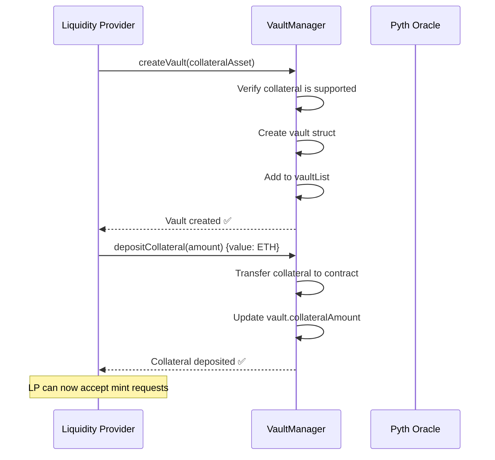
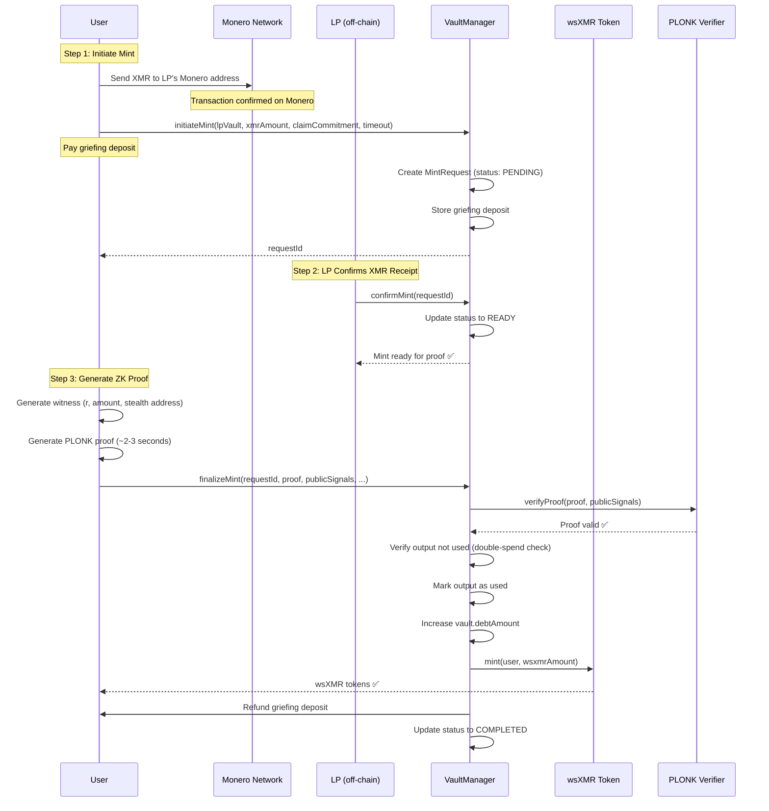
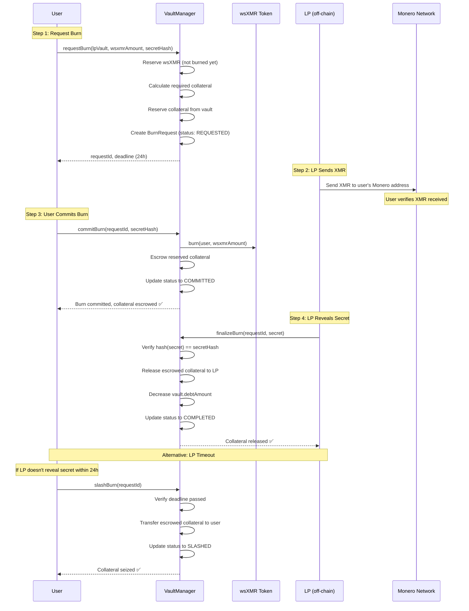
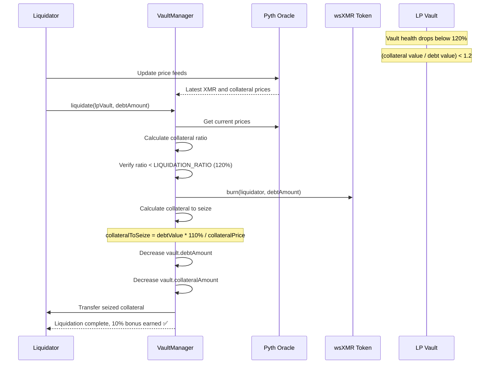

# WrapSynth Technical Specification v9.0

*Vault-Based Wrapped Monero with Zero-Knowledge Proofs*

**Architecture: LP Vaults → Collateralized Debt → Atomic Swaps → ZK Proofs**

**Status: ✅ Contracts Implemented | ✅ Ready for Deployment | ⚠️ Requires Security Audit**

---

## 1. Overview

### 1.1 Core Design Principles

1. **Vault-Based Collateralization**: Each LP manages their own vault with customizable collateral
2. **Overcollateralization**: 150% collateral ratio ensures wsXMR is always backed
3. **Atomic Swap Mechanics**: HTLC-style commitments for trustless mint/burn operations
4. **Zero-Knowledge Proofs**: PLONK proofs verify Monero transaction ownership without revealing secrets
5. **Multi-Collateral Support**: Accept ETH, wstETH, or any ERC20 as collateral
6. **Pyth Oracle Integration**: Real-time price feeds for accurate collateral valuation

### 1.2 System Architecture

```
┌─────────────────────────────────────────────────────────────────┐
│                        Layer 3: Token                            │
│   wsXMR (ERC-20, 8 decimals = 1e-8 XMR)                        │
│   - Minted when users prove XMR ownership                       │
│   - Burned when users redeem for XMR                            │
│   - Only VaultManager can mint/burn                             │
└──────────────────────────────┬──────────────────────────────────┘
                               │
┌──────────────────────────────▼──────────────────────────────────┐
│                    Layer 2: Vault System                         │
│   VaultManager.sol - Core Protocol Logic                        │
│   - Individual LP vaults with collateral                        │
│   - Mint/burn request management                                │
│   - Collateral ratio enforcement (150% min)                     │
│   - Liquidation system (120% threshold)                         │
│   - Atomic swap commitments (HTLC-style)                        │
└──────────────────────────────┬──────────────────────────────────┘
                               │
┌──────────────────────────────▼──────────────────────────────────┐
│                   Layer 1: Verification                          │
│   PLONK Zero-Knowledge Proofs (~3.8M constraints)               │
│   - Proves ownership of Monero UTXO                             │
│   - Verifies stealth address derivation                         │
│   - Validates amount decryption                                 │
│   - Prevents double-spending                                    │
└──────────────────────────────┬──────────────────────────────────┘
                               │
┌──────────────────────────────▼──────────────────────────────────┐
│                    Layer 0: Price Oracles                        │
│   Pyth Network Integration                                      │
│   - XMR/USD price feed                                          │
│   - Collateral asset price feeds (ETH, wstETH, etc.)           │
│   - 5-minute staleness check                                    │
│   - Pull-based updates                                          │
└─────────────────────────────────────────────────────────────────┘
```

---

## 2. Core Contracts

### 2.1 wsXMR.sol - Token Contract

**Purpose**: ERC-20 token representing wrapped Monero

**Key Features**:
- 8 decimals (matching Monero's atomic units)
- Only VaultManager can mint/burn
- Standard ERC-20 interface for DeFi composability
- Ownable for VaultManager address updates

**Functions**:
```solidity
function mint(address _to, uint256 _amount) external;
function burn(address _from, uint256 _amount) external;
function setVaultManager(address _vaultManager) external onlyOwner;
```

### 2.2 VaultManager.sol - Core Protocol

**Purpose**: Manages LP vaults, collateralization, and mint/burn operations

**Key Constants**:
```solidity
uint256 public constant COLLATERAL_RATIO = 150;      // 150% overcollateralization
uint256 public constant LIQUIDATION_RATIO = 120;     // 120% liquidation threshold
uint256 public constant LIQUIDATION_BONUS = 110;     // 110% liquidator reward
uint256 public constant BURN_TIMEOUT = 24 hours;     // LP must fulfill burn within 24h
uint256 public constant MAX_MINT_TIMEOUT = 7 days;   // Maximum timeout for mint requests
```

**Vault Structure**:
```solidity
struct Vault {
    address lpAddress;
    address collateralAsset;      // address(0) for ETH
    uint256 collateralAmount;
    uint256 lockedCollateral;     // Reserved for pending burns
    uint256 debtAmount;           // Amount of wsXMR backed by this vault
    uint256 mintGriefingDeposit;  // ETH deposit required for mint requests
    bool active;
}
```

**Mint Request Flow**:
```solidity
struct MintRequest {
    bytes32 requestId;
    address user;
    address lpVault;
    uint256 xmrAmount;           // Amount in piconero (1e12 per XMR)
    uint256 wsxmrAmount;         // Amount in 1e8 units
    bytes32 claimCommitment;     // Hash of secret for atomic swap
    uint256 timeout;
    uint256 griefingDeposit;
    MintStatus status;           // INVALID, PENDING, READY, COMPLETED, CANCELLED
}
```

**Burn Request Flow**:
```solidity
struct BurnRequest {
    bytes32 requestId;
    address user;
    address lpVault;
    uint256 wsxmrAmount;
    bytes32 secretHash;          // User's secret hash
    uint256 deadline;            // LP must reveal secret before this
    uint256 lockedCollateral;    // Collateral escrowed for this burn
    BurnStatus status;           // INVALID, REQUESTED, COMMITTED, COMPLETED, SLASHED, CANCELLED
}
```

---

## 3. Complete Flow Diagrams

### 3.1 LP Vault Creation



### 3.2 Mint Flow (User → wsXMR)



### 3.3 Burn Flow (wsXMR → XMR)



### 3.4 Liquidation Flow



---

## 4. Key Functions

### 4.1 Vault Management

```solidity
// Create a new LP vault
function createVault(address _collateralAsset) external;

// Deposit collateral into vault
function depositCollateral(uint256 _amount) external payable nonReentrant;

// Withdraw collateral (only if health ratio allows)
function withdrawCollateral(uint256 _amount) external nonReentrant;

// Set griefing deposit for mint requests
function setMintGriefingDeposit(uint256 _deposit) external;
```

### 4.2 Mint Operations

```solidity
// User initiates mint request
function initiateMint(
    address _lpVault,
    uint256 _xmrAmount,
    bytes32 _claimCommitment,
    uint256 _timeoutDuration
) external payable returns (bytes32 requestId);

// LP confirms XMR receipt
function confirmMint(bytes32 _requestId) external;

// User finalizes mint with ZK proof
function finalizeMint(
    bytes32 _requestId,
    uint256[24] calldata _proof,
    uint256[9] calldata _publicSignals,
    bytes calldata _dleqProof,
    bytes calldata _ed25519Proof,
    bytes32 _outputId,
    uint256 _blockHeight,
    bytes32[] calldata _txMerkleProof,
    bytes32[] calldata _outputMerkleProof,
    bytes32 _txPublicKey,
    address _prover
) external;

// User cancels mint if LP doesn't confirm
function cancelMint(bytes32 _requestId) external;
```

### 4.3 Burn Operations

```solidity
// User requests burn
function requestBurn(
    address _lpVault,
    uint256 _wsxmrAmount,
    bytes32 _secretHash
) external returns (bytes32 requestId);

// User commits burn after receiving XMR
function commitBurn(bytes32 _requestId, bytes32 _secretHash) external;

// LP finalizes burn by revealing secret
function finalizeBurn(bytes32 _requestId, bytes32 _secret) external;

// User slashes LP if they don't reveal secret
function slashBurn(bytes32 _requestId) external;

// User cancels burn if LP doesn't respond
function cancelBurn(bytes32 _requestId) external;
```

### 4.4 Liquidation

```solidity
// Liquidate undercollateralized vault
function liquidate(address _lpVault, uint256 _debtAmount) external;
```

### 4.5 Oracle Management

```solidity
// Update Pyth price feeds
function updatePythPrices(bytes[] calldata pythUpdateData) external payable;

// Add support for new collateral type
function addCollateralSupport(address _asset, bytes32 _pythFeedId) external onlyOwner;

// Set maximum price age
function setPriceMaxAge(uint256 _maxAge) external onlyOwner;
```

---

## 5. Security Model

### 5.1 Collateralization

| Ratio | Description | Actions Allowed |
|-------|-------------|-----------------|
| ≥150% | Healthy | All operations (mint, burn, withdraw) |
| 120-150% | Warning | Mints disabled, burns allowed, withdrawals restricted |
| <120% | Liquidatable | Vault can be liquidated by anyone |

### 5.2 Atomic Swap Security

**Mint Flow**:
1. User commits to secret hash (claimCommitment)
2. LP verifies XMR receipt off-chain
3. User proves ownership with ZK proof
4. User receives wsXMR

**Burn Flow**:
1. User commits to secret hash
2. LP sends XMR to user's Monero address
3. User commits burn (wsXMR burned, collateral escrowed)
4. LP reveals secret to unlock collateral
5. If LP fails to reveal within 24h, user can slash and seize collateral

### 5.3 Griefing Protection

- **Mint Griefing Deposit**: LPs can require users to pay ETH deposit when initiating mint
  - Refunded on successful completion
  - Forfeited to LP if user cancels or times out
  - Prevents spam mint requests

### 5.4 Double-Spend Prevention

- Each Monero output can only be used once for minting
- `usedOutputs` mapping tracks all used outputs
- ZK proof includes output ID verification

### 5.5 Price Oracle Security

- **Pyth Network**: Decentralized oracle with multiple data sources
- **Staleness Check**: Prices must be updated within 5 minutes
- **Pull-Based**: Prices pushed on-chain before critical operations
- **Multi-Feed**: Separate feeds for XMR and each collateral type

---

## 6. Economic Parameters

### 6.1 Constants

```solidity
COLLATERAL_RATIO = 150        // 150% minimum collateral
LIQUIDATION_RATIO = 120       // 120% liquidation threshold
LIQUIDATION_BONUS = 110       // 110% liquidator reward (10% bonus)
BURN_TIMEOUT = 24 hours       // LP must reveal secret within 24h
MAX_MINT_TIMEOUT = 7 days     // Maximum mint request timeout
```

### 6.2 Pyth Price Feeds

| Asset | Feed ID | Description |
|-------|---------|-------------|
| XMR/USD | `0x46b8cc9347f04391764a0361e0b17c3ba394b001e7c304f7650f6376e37c321d` | Monero price |
| ETH/USD | `0x31491744e2dbf6df7fcf4ac0820d18a609b49076d45066d3568424e62f686cd1` | Ethereum price (for ETH collateral) |

### 6.3 Decimals

- **wsXMR**: 8 decimals (1 wsXMR = 1e8 units)
- **XMR**: 12 decimals (1 XMR = 1e12 piconero)
- **Conversion**: 1 XMR = 1 wsXMR (but different decimal representations)

---

## 7. Gas Costs (Estimated)

| Function | Gas (Gnosis) | Est. Cost (xDAI) |
|----------|--------------|------------------|
| createVault | ~180k | ~$0.01 |
| depositCollateral | ~250k | ~$0.02 |
| initiateMint | ~200k | ~$0.01 |
| confirmMint | ~150k | ~$0.01 |
| finalizeMint | ~800k | ~$0.05 |
| requestBurn | ~200k | ~$0.01 |
| commitBurn | ~250k | ~$0.02 |
| finalizeBurn | ~200k | ~$0.01 |
| liquidate | ~300k | ~$0.02 |

*Note: Gnosis Chain has very low gas costs compared to Ethereum mainnet*

---

## 8. Deployment Addresses

### Gnosis Mainnet (ChainID: 100)

| Contract | Address | Notes |
|----------|---------|-------|
| VaultManager | TBD | To be deployed |
| wsXMR | TBD | To be deployed |
| PlonkVerifier | TBD | ~146KB contract |
| Pyth Oracle | `0x2880aB155794e7179c9eE2e38200202908C17B43` | Already deployed |
| wstETH | `0x6C76971f98945AE98dD7d4DFcA8711ebea946eA6` | Lido Wrapped Staked ETH |

---

## 9. Comparison with Other Bridges

| Feature | WrapSynth | tBTC | renBTC | WBTC |
|---------|-----------|------|--------|------|
| Asset | Monero (XMR) | Bitcoin | Bitcoin | Bitcoin |
| Trust Model | ZK Proofs + Collateral | Threshold Signatures | Federated | Centralized Custodian |
| Collateralization | 150% overcollateralized | 150% overcollateralized | None | None |
| Privacy | High (Monero native) | Low | Low | Low |
| Decentralization | High | Medium | Low | Very Low |
| Proof System | PLONK ZK-SNARKs | None | None | None |
| Liquidation | Yes (120% threshold) | Yes | N/A | N/A |

---

## 10. Future Enhancements

### 10.1 Planned Features

- [ ] **Uniswap V4 Integration**: Custom hooks for privacy-preserving swaps
- [ ] **Multi-Chain Deployment**: Expand to Arbitrum, Optimism, Base
- [ ] **Yield Strategies**: Auto-compound collateral yields
- [ ] **Governance**: Decentralized parameter updates
- [ ] **Insurance Fund**: Protocol-owned reserve for extreme events

### 10.2 Research Areas

- [ ] **Recursive Proofs**: Reduce on-chain verification costs
- [ ] **Cross-Chain Messaging**: Bridge wsXMR across chains
- [ ] **Privacy Relayers**: Anonymous minting without revealing recipient
- [ ] **Decentralized Oracle**: Multi-node Monero block verification

---

## 11. Security Considerations

### 11.1 Audit Status

⚠️ **NOT YET AUDITED** - This is experimental software

**Required before mainnet**:
- Professional security audit by qualified firms
- Formal verification of critical functions
- Economic modeling and stress testing
- Bug bounty program

### 11.2 Known Risks

1. **Smart Contract Risk**: Bugs in VaultManager or wsXMR could lead to loss of funds
2. **Oracle Risk**: Pyth oracle manipulation could affect collateral ratios
3. **Liquidation Risk**: Rapid price movements could leave vaults undercollateralized
4. **ZK Proof Risk**: Circuit bugs could allow false proofs
5. **Monero Risk**: Changes to Monero protocol could break proof system

### 11.3 Mitigation Strategies

- Comprehensive testing and audits
- Gradual rollout with caps on total value locked
- Emergency pause functionality
- Multi-sig admin controls
- Insurance fund for extreme events

---

## 12. License & Disclaimer

**License:** LGPLv3 (Solidity contracts), MIT (Circom circuits)

**Disclaimer:** This is experimental cryptographic software for research purposes. Not recommended for production use with real funds until professionally audited. Use at your own risk.

---

*Document Version: 9.0.0*  
*Last Updated: March 2026*  
*Architecture: VaultManager-based with Pyth Oracle Integration*

**v9.0 Changes from v8.0:**
- Complete rewrite to reflect VaultManager architecture
- Removed Uniswap V4 integration (not yet implemented)
- Removed RISC Zero oracle (using Pyth instead)
- Removed self-minting concept (standard mint/burn flows)
- Added detailed atomic swap mechanics
- Added liquidation system documentation
- Updated all flow diagrams to match implementation
- Simplified to match actual deployed contracts
