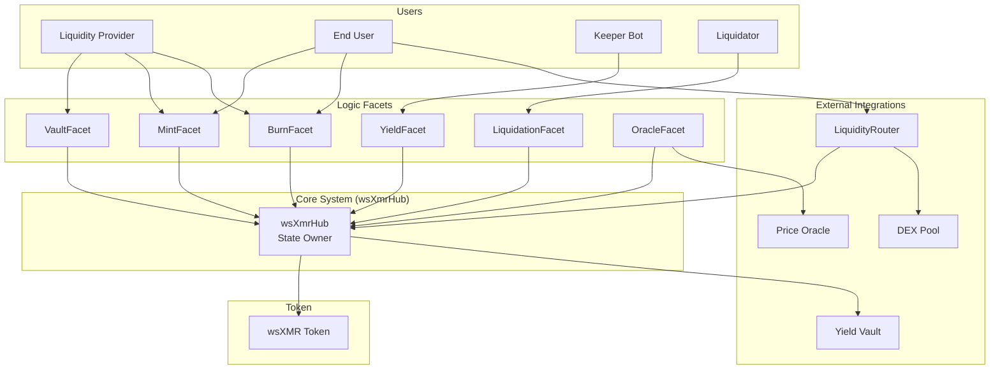
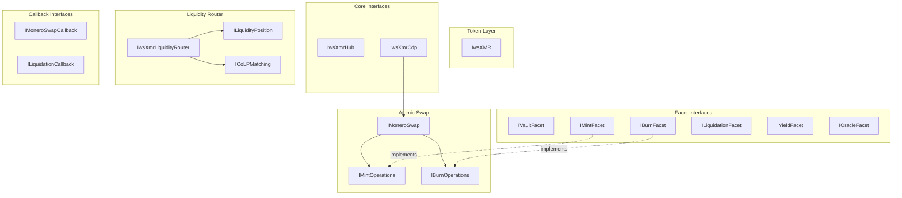

# wsXMR Interface Architecture

This document defines the complete interface architecture for the wsXMR system - a collateralized synthetic Monero token with atomic swap mechanics and AMM liquidity integration.

## System Overview



---

## Interface Hierarchy



---

## Token Interface

### IwsXMR.sol

```solidity
// SPDX-License-Identifier: LGPLv3
pragma solidity ^0.8.19;

import {IERC20} from "@openzeppelin/contracts/token/ERC20/IERC20.sol";
import {IERC20Permit} from "@openzeppelin/contracts/token/ERC20/extensions/IERC20Permit.sol";

/**
 * @title IwsXMR
 * @notice Interface for the wrapped synthetic Monero token
 * @dev ERC20 with privileged mint/burn controlled by wsXmrHub
 */
interface IwsXMR is IERC20, IERC20Permit {
    // ========== ERRORS ==========
    
    /// @notice Thrown when caller is not the authorized minter
    error OnlyHub();
    
    // ========== VIEWS ==========
    
    /// @notice Address authorized to mint and burn tokens
    /// @return The hub contract address
    function hub() external view returns (address);
    
    /// @notice Token decimals (8, matching XMR piconero / 1e4)
    /// @return Number of decimals
    function decimals() external view returns (uint8);
    
    // ========== PRIVILEGED OPERATIONS ==========
    
    /// @notice Mint tokens to an address
    /// @dev Only callable by hub
    /// @param to Recipient address
    /// @param amount Amount to mint (8 decimals)
    function mint(address to, uint256 amount) external;
    
    /// @notice Burn tokens from an address
    /// @dev Only callable by hub
    /// @param from Address to burn from
    /// @param amount Amount to burn (8 decimals)
    function burn(address from, uint256 amount) external;
}
```

---

## Core Hub Interface

### IwsXmrHub.sol

```solidity
// SPDX-License-Identifier: LGPLv3
pragma solidity ^0.8.19;

/**
 * @title IwsXmrHub
 * @notice Central coordinator and state owner for the wsXMR system
 * @dev Holds all state, delegates logic to facets, controls token operations
 */
interface IwsXmrHub {
    // ========== STRUCTS ==========
    
    struct GlobalState {
        address wsxmrToken;
        address liquidityRouter;
        address deployer;
        address pythOracle;
        uint256 globalTotalDebt;
        uint256 globalDebtIndex;
        uint256 globalBadDebt;
        uint256 globalPendingBurnDebt;
        uint256 yieldWarChest;
        uint256 lastBuyTimestamp;
        uint256 globalLpPrincipal;
        uint256 globalLpPrincipalShares;
        uint256 globalPendingSDAI;
        uint256 requestNonce;
        uint256 vaultCount;
    }
    
    // ========== EVENTS ==========
    
    event FacetsRegistered(
        address vaultFacet,
        address mintFacet,
        address burnFacet,
        address liquidationFacet,
        address yieldFacet,
        address oracleFacet
    );
    event LiquidityRouterSet(address router);
    
    // ========== ERRORS ==========
    
    error Unauthorized();
    error ZeroAddress();
    error AlreadyInitialized();
    error ReentrancyGuard();
    
    // ========== INITIALIZATION ==========
    
    /// @notice Register all facet contracts (one-time setup)
    /// @param vaultFacet Address of VaultFacet
    /// @param mintFacet Address of MintFacet
    /// @param burnFacet Address of BurnFacet
    /// @param liquidationFacet Address of LiquidationFacet
    /// @param yieldFacet Address of YieldFacet
    /// @param oracleFacet Address of OracleFacet
    function registerFacets(
        address vaultFacet,
        address mintFacet,
        address burnFacet,
        address liquidationFacet,
        address yieldFacet,
        address oracleFacet
    ) external;
    
    /// @notice Set the liquidity router address (one-time setup)
    /// @param router Address of wsXmrLiquidityRouter
    function setLiquidityRouter(address router) external;
    
    // ========== FACET OPERATIONS ==========
    
    /// @notice Mint wsXMR tokens (only callable by facets)
    /// @param to Recipient address
    /// @param amount Amount to mint
    function mintTokens(address to, uint256 amount) external;
    
    /// @notice Burn wsXMR tokens (only callable by facets)
    /// @param from Address to burn from
    /// @param amount Amount to burn
    function burnTokens(address from, uint256 amount) external;
    
    /// @notice Transfer ERC20 held by hub (only callable by facets)
    /// @param token Token address
    /// @param to Recipient
    /// @param amount Amount to transfer
    function transferAsset(address token, address to, uint256 amount) external;
    
    /// @notice Approve ERC20 spending (only callable by facets)
    /// @param token Token address
    /// @param spender Approved spender
    /// @param amount Approval amount
    function approveAsset(address token, address spender, uint256 amount) external;
    
    // ========== REENTRANCY GUARDS ==========
    
    /// @notice Enter reentrancy guard (only callable by facets)
    function enterNonReentrant() external;
    
    /// @notice Exit reentrancy guard (only callable by facets)
    function exitNonReentrant() external;
    
    // ========== VIEW FUNCTIONS ==========
    
    /// @notice Check if address is a registered facet
    function facets(address addr) external view returns (bool);
    
    /// @notice Get global system state
    function getGlobalState() external view returns (GlobalState memory);
    
    /// @notice Get the wsXMR token address
    function wsxmrToken() external view returns (address);
    
    /// @notice Get facet addresses
    function vaultFacet() external view returns (address);
    function mintFacet() external view returns (address);
    function burnFacet() external view returns (address);
    function liquidationFacet() external view returns (address);
    function yieldFacet() external view returns (address);
    function oracleFacet() external view returns (address);
}
```

---

## Atomic Swap Interfaces

### IMoneroSwap.sol

```solidity
// SPDX-License-Identifier: LGPLv3
pragma solidity ^0.8.19;

import {IMintOperations} from "./IMintOperations.sol";
import {IBurnOperations} from "./IBurnOperations.sol";

/**
 * @title IMoneroSwap
 * @notice Combined interface for Monero atomic swap operations
 * @dev Aggregates mint and burn flows into a single interface
 */
interface IMoneroSwap is IMintOperations, IBurnOperations {
    // Combined interface - inherits all from IMintOperations and IBurnOperations
}
```

### IMintOperations.sol

```solidity
// SPDX-License-Identifier: LGPLv3
pragma solidity ^0.8.19;

/**
 * @title IMintOperations
 * @notice Interface for XMR -> wsXMR atomic swap mint operations
 * @dev Implements Farcaster-style PTLC atomic swap with Ed25519 commitments
 * 
 * Flow:
 * 1. User calls initiateMint() with commitment and griefing deposit
 * 2. LP calls provideLPKey() with their public key
 * 3. User locks XMR on Monero using combined keys
 * 4. LP verifies Monero lock, calls setMintReady()
 * 5. LP claims XMR on Monero (reveals secret)
 * 6. Anyone calls finalizeMint() with revealed secret
 */
interface IMintOperations {
    // ========== ENUMS ==========
    
    enum MintStatus {
        INVALID,    // Request doesn't exist
        PENDING,    // Initiated, waiting for LP
        READY,      // LP confirmed XMR lock
        COMPLETED,  // Secret revealed, wsXMR minted
        CANCELLED   // Timed out or invalidated
    }
    
    // ========== STRUCTS ==========
    
    struct MintRequest {
        bytes32 requestId;
        address initiator;          // Who paid griefing deposit
        address recipient;          // Who receives wsXMR
        address lpVault;            // LP handling this mint
        uint256 xmrAmount;          // XMR amount (12 decimals)
        uint256 wsxmrAmount;        // wsXMR amount (8 decimals)
        uint256 feeAmount;          // LP fee in wsXMR
        bytes32 claimCommitment;    // Hash of secret point
        uint256 timeout;            // Deadline timestamp
        uint256 griefingDeposit;    // ETH deposit amount
        uint256 normalizedDebtAmount;
        uint256 vaultMintNonce;     // For invalidation on liquidation
        MintStatus status;
    }
    
    // ========== EVENTS ==========
    
    event MintInitiated(
        bytes32 indexed requestId,
        address indexed initiator,
        address indexed recipient,
        address lpVault,
        uint256 xmrAmount,
        uint256 wsxmrAmount,
        uint256 feeAmount,
        bytes32 claimCommitment,
        uint256 timeout
    );
    
    event LPKeyProvided(bytes32 indexed requestId, bytes32 lpPublicKey);
    event MintReady(bytes32 indexed requestId);
    event MintFinalized(bytes32 indexed requestId, bytes32 secret);
    event MintCancelled(bytes32 indexed requestId);
    
    // ========== ERRORS ==========
    
    error ZeroAddress();
    error ZeroAmount();
    error InvalidCommitment();
    error InvalidTimeout();
    error InvalidValue();
    error InvalidSecret();
    error InvalidStatus();
    error VaultDoesNotExist();
    error InsufficientDeposit();
    error InsufficientCollateral();
    error MintAlreadyExists();
    error Unauthorized();
    error DeadlineExpired();
    error TimeoutNotReached();
    
    // ========== FUNCTIONS ==========
    
    /// @notice Initiate a mint request
    /// @param lpVault Address of LP vault to use
    /// @param recipient Address to receive wsXMR
    /// @param xmrAmount Amount of XMR in atomic units (12 decimals)
    /// @param claimCommitment Ed25519 commitment (keccak256 of public point)
    /// @param timeoutDuration Seconds until request can be cancelled
    /// @return requestId Unique identifier for this request
    function initiateMint(
        address lpVault,
        address recipient,
        uint256 xmrAmount,
        bytes32 claimCommitment,
        uint256 timeoutDuration
    ) external payable returns (bytes32 requestId);
    
    /// @notice LP provides their public key for the atomic swap
    /// @param requestId The mint request ID
    /// @param lpPublicKey LP's Ed25519 public spend key (P_b)
    function provideLPKey(bytes32 requestId, bytes32 lpPublicKey) external;
    
    /// @notice LP confirms XMR has been locked on Monero
    /// @param requestId The mint request ID
    function setMintReady(bytes32 requestId) external;
    
    /// @notice Finalize mint by revealing the secret
    /// @param requestId The mint request ID
    /// @param secret The Ed25519 secret (scalar)
    function finalizeMint(bytes32 requestId, bytes32 secret) external;
    
    /// @notice Cancel a timed-out mint request (permissionless)
    /// @param requestId The mint request ID
    function cancelMint(bytes32 requestId) external;
    
    // ========== VIEW FUNCTIONS ==========
    
    /// @notice Get mint request details
    function getMintRequest(bytes32 requestId) external view returns (MintRequest memory);
    
    /// @notice Get LP's public key for a request
    function getLPPublicKey(bytes32 requestId) external view returns (bytes32);
    
    /// @notice Get user's mint request IDs
    function getUserMintRequests(address user) external view returns (bytes32[] memory);
}
```

### IBurnOperations.sol

```solidity
// SPDX-License-Identifier: LGPLv3
pragma solidity ^0.8.19;

/**
 * @title IBurnOperations
 * @notice Interface for wsXMR -> XMR atomic swap burn operations
 * @dev Three-step handshake with slashing for LP non-compliance
 * 
 * Flow:
 * 1. User calls requestBurn() - wsXMR burned, collateral locked
 * 2. LP locks XMR on Monero, calls proposeHash() with secret hash
 * 3. User verifies Monero lock, calls confirmMoneroLock()
 * 4. User claims XMR on Monero (LP sees secret)
 * 5. LP calls finalizeBurn() with secret to unlock collateral
 * 
 * Failure modes:
 * - LP never responds: User calls cancelBurn() after timeout
 * - LP doesn't reveal secret: User calls claimSlashedCollateral()
 */
interface IBurnOperations {
    // ========== ENUMS ==========
    
    enum BurnStatus {
        INVALID,    // Request doesn't exist
        REQUESTED,  // wsXMR burned, collateral locked
        PROPOSED,   // LP proposed secret hash
        COMMITTED,  // User confirmed Monero lock
        COMPLETED,  // LP revealed secret
        SLASHED,    // LP failed, collateral seized
        CANCELLED   // Cancelled before commitment
    }
    
    // ========== STRUCTS ==========
    
    struct BurnRequest {
        bytes32 requestId;
        address user;               // Who is burning
        address lpVault;            // LP handling this burn
        uint256 wsxmrAmount;        // wsXMR amount burned (8 decimals)
        uint256 xmrAmount;          // XMR to receive (12 decimals)
        uint256 lockedCollateral;   // Base collateral locked
        uint256 rewardCollateral;   // Bonus collateral for user
        bytes32 secretHash;         // Hash of LP's secret
        uint256 deadline;           // Current phase deadline
        uint256 vaultLiquidationNonce;
        uint256 normalizedDebtAmount;
        BurnStatus status;
    }
    
    // ========== EVENTS ==========
    
    event BurnRequested(
        bytes32 indexed requestId,
        address indexed user,
        address indexed lpVault,
        uint256 wsxmrAmount,
        uint256 xmrAmount,
        uint256 rewardCollateral
    );
    
    event HashProposed(bytes32 indexed requestId, bytes32 secretHash);
    event BurnCommitted(bytes32 indexed requestId, uint256 deadline);
    event BurnFinalized(bytes32 indexed requestId, bytes32 secret, uint256 rewardPaid);
    event BurnRewardShortfall(bytes32 indexed requestId, uint256 expected, uint256 actual);
    event BurnSlashed(bytes32 indexed requestId, address indexed user, uint256 collateralSeized);
    event BurnCancelled(bytes32 indexed requestId);
    
    // ========== ERRORS ==========
    
    error ZeroAddress();
    error ZeroAmount();
    error BelowMinimumBurn();
    error MaxBurnRequestsReached();
    error VaultDoesNotExist();
    error InsufficientDebt();
    error InsufficientCollateral();
    error BurnAlreadyExists();
    error InvalidStatus();
    error InvalidSecret();
    error Unauthorized();
    error OnlyUserCanInitiate();
    error OnlyRouter();
    error DeadlineExpired();
    error DeadlineNotExpired();
    error GracePeriodOnlyUser();
    error BurnInvalidatedByLiquidation();
    
    // ========== FUNCTIONS ==========
    
    /// @notice Request a burn (Step 1)
    /// @dev Burns wsXMR and locks collateral
    /// @param wsxmrAmount Amount of wsXMR to burn
    /// @param lpVault LP vault to handle the burn
    /// @param user Address whose wsXMR to burn (must be msg.sender)
    /// @return requestId Unique identifier
    function requestBurn(
        uint256 wsxmrAmount,
        address lpVault,
        address user
    ) external returns (bytes32 requestId);
    
    /// @notice Request burn from router's internal balance
    /// @dev Only callable by authorized liquidity router
    function requestBurnFromRouter(
        uint256 wsxmrAmount,
        address lpVault,
        address user
    ) external returns (bytes32 requestId);
    
    /// @notice LP proposes secret hash after locking XMR (Step 2)
    /// @param requestId The burn request ID
    /// @param secretHash Hash of LP's secret
    function proposeHash(bytes32 requestId, bytes32 secretHash) external;
    
    /// @notice User confirms Monero lock is valid (Step 3)
    /// @param requestId The burn request ID
    function confirmMoneroLock(bytes32 requestId) external;
    
    /// @notice LP reveals secret to unlock collateral (Step 4)
    /// @param requestId The burn request ID
    /// @param secret The secret to reveal
    function finalizeBurn(bytes32 requestId, bytes32 secret) external;
    
    /// @notice Claim slashed collateral after LP failure
    /// @param requestId The burn request ID
    function claimSlashedCollateral(bytes32 requestId) external;
    
    /// @notice Cancel burn after timeout (permissionless cleanup)
    /// @param requestId The burn request ID
    function cancelBurn(bytes32 requestId) external;
    
    // ========== VIEW FUNCTIONS ==========
    
    /// @notice Get burn request details
    function getBurnRequest(bytes32 requestId) external view returns (BurnRequest memory);
    
    /// @notice Get user's burn request IDs
    function getUserBurnRequests(address user) external view returns (bytes32[] memory);
    
    /// @notice Get vault's pending burn request IDs
    function getVaultBurnRequests(address vault) external view returns (bytes32[] memory);
}
```

---

## Facet Interfaces

### IVaultFacet.sol

```solidity
// SPDX-License-Identifier: LGPLv3
pragma solidity ^0.8.19;

/**
 * @title IVaultFacet
 * @notice Interface for vault management operations
 * @dev Handles vault creation, collateral, and configuration
 */
interface IVaultFacet {
    // ========== STRUCTS ==========
    
    struct Vault {
        address lpAddress;
        uint256 collateralShares;
        uint256 lockedCollateral;
        uint256 normalizedDebt;
        uint256 pendingDebt;
        uint16 maxMintBps;
        uint256 mintGriefingDeposit;
        uint16 mintFeeBps;
        uint16 burnRewardBps;
        uint256 liquidationNonce;
        uint256 mintNonce;
        uint256 minBurnAmount;
        bool active;
    }
    
    // ========== EVENTS ==========
    
    event VaultCreated(address indexed lpAddress);
    event CollateralDeposited(address indexed lpAddress, uint256 underlyingAmount, uint256 shares);
    event CollateralWithdrawn(address indexed lpAddress, uint256 underlyingAmount, uint256 shares);
    event MintGriefingDepositUpdated(address indexed lpVault, uint256 newDeposit);
    event VaultMarketMetricsUpdated(address indexed lpVault, uint16 mintFeeBps, uint16 burnRewardBps);
    event MaxMintBpsUpdated(address indexed lpVault, uint16 newMaxMintBps);
    event MinBurnAmountUpdated(address indexed lpVault, uint256 newMinBurnAmount);
    event ReturnQueued(address indexed recipient, address indexed token, uint256 amount);
    event ReturnsWithdrawn(address indexed recipient, address indexed token, uint256 amount);
    
    // ========== ERRORS ==========
    
    error VaultAlreadyExists();
    error VaultDoesNotExist();
    error MaxVaultsReached();
    error ZeroAmount();
    error InsufficientCollateral();
    error ExceedsMaxMargin();
    error InvalidValue();
    error ETHTransferFailed();
    
    // ========== VAULT LIFECYCLE ==========
    
    /// @notice Create a new LP vault
    function createVault() external;
    
    /// @notice Deactivate vault (LP can reactivate by depositing)
    function deactivateVault() external;
    
    // ========== COLLATERAL MANAGEMENT ==========
    
    /// @notice Deposit native token (auto-converts to yield-bearing)
    /// @param amount Amount of native token to deposit
    function depositCollateral(uint256 amount) external;
    
    /// @notice Deposit yield-bearing shares directly
    /// @param shares Amount of shares to deposit
    function depositShares(uint256 shares) external;
    
    /// @notice Withdraw collateral (if health ratio allows)
    /// @param shares Amount of shares to withdraw
    function withdrawCollateral(uint256 shares) external;
    
    // ========== VAULT CONFIGURATION ==========
    
    /// @notice Set griefing deposit required for mint requests
    /// @param deposit ETH amount required (0 to disable)
    function setMintGriefingDeposit(uint256 deposit) external;
    
    /// @notice Set mint fees and burn rewards
    /// @param mintFeeBps Fee charged for minting (basis points, max 1000)
    /// @param burnRewardBps Reward paid for burning (basis points, max 1000)
    function setVaultMarketMetrics(uint16 mintFeeBps, uint16 burnRewardBps) external;
    
    /// @notice Set maximum single mint size
    /// @param maxMintBps Max mint as percentage of capacity (basis points)
    function setMaxMintBps(uint16 maxMintBps) external;
    
    /// @notice Set minimum burn amount
    /// @param minAmount Minimum wsXMR for burn requests (0 = global default)
    function setMinBurnAmount(uint256 minAmount) external;
    
    // ========== PENDING RETURNS ==========
    
    /// @notice Withdraw queued returns (pull pattern)
    /// @param token Token address (address(0) for ETH)
    function withdrawReturns(address token) external;
    
    // ========== VIEW FUNCTIONS ==========
    
    /// @notice Get vault details
    function getVault(address lpAddress) external view returns (Vault memory);
    
    /// @notice Get vault health ratio
    /// @return ratio Collateral ratio (150 = 150%)
    function getVaultHealth(address lpAddress) external view returns (uint256 ratio);
    
    /// @notice Get vault's actual debt (after applying debt index)
    function getVaultDebt(address lpAddress) external view returns (uint256);
    
    /// @notice Get total number of vaults
    function getVaultCount() external view returns (uint256);
    
    /// @notice Get vault address by index
    function getVaultAtIndex(uint256 index) external view returns (address);
    
    /// @notice Get pending returns for user
    function getPendingReturns(address user, address token) external view returns (uint256);
    
    /// @notice Check if address has an active vault
    function hasActiveVault(address lpAddress) external view returns (bool);
}
```

### IMintFacet.sol

```solidity
// SPDX-License-Identifier: LGPLv3
pragma solidity ^0.8.19;

import {IMintOperations} from "./IMintOperations.sol";

/**
 * @title IMintFacet
 * @notice Interface for the MintFacet contract
 * @dev Implements IMintOperations with additional facet-specific functionality
 */
interface IMintFacet is IMintOperations {
    // ========== CONSTANTS ==========
    
    /// @notice Maximum timeout for mint requests
    function MAX_MINT_TIMEOUT() external pure returns (uint256);
    
    /// @notice Extension time after LP marks ready
    function MINT_READY_EXTENSION() external pure returns (uint256);
    
    // ========== ADDITIONAL VIEWS ==========
    
    /// @notice Get all pending mint requests for a vault
    function getVaultPendingMints(address lpVault) external view returns (bytes32[] memory);
    
    /// @notice Calculate wsXMR amount from XMR amount
    function calculateWsxmrAmount(uint256 xmrAmount) external pure returns (uint256);
    
    /// @notice Calculate fee for a given wsXMR amount and vault
    function calculateMintFee(
        address lpVault,
        uint256 wsxmrAmount
    ) external view returns (uint256 feeAmount);
}
```

### IBurnFacet.sol

```solidity
// SPDX-License-Identifier: LGPLv3
pragma solidity ^0.8.19;

import {IBurnOperations} from "./IBurnOperations.sol";

/**
 * @title IBurnFacet
 * @notice Interface for the BurnFacet contract
 * @dev Implements IBurnOperations with additional facet-specific functionality
 */
interface IBurnFacet is IBurnOperations {
    // ========== CONSTANTS ==========
    
    /// @notice Time LP has to respond to burn request
    function BURN_REQUEST_TIMEOUT() external pure returns (uint256);
    
    /// @notice Time LP has to reveal secret after commitment
    function BURN_COMMIT_TIMEOUT() external pure returns (uint256);
    
    /// @notice Collateral lock ratio (130%)
    function BURN_LOCK_RATIO() external pure returns (uint256);
    
    /// @notice Global minimum burn amount
    function MIN_BURN_AMOUNT() external pure returns (uint256);
    
    /// @notice Maximum burn requests per vault
    function MAX_BURN_REQUESTS_PER_VAULT() external pure returns (uint256);
    
    // ========== ADDITIONAL VIEWS ==========
    
    /// @notice Calculate collateral to lock for a burn
    function calculateBurnCollateral(
        address lpVault,
        uint256 wsxmrAmount
    ) external view returns (uint256 baseLock, uint256 rewardLock);
    
    /// @notice Check if burn amount meets vault minimum
    function meetsMinimumBurn(address lpVault, uint256 wsxmrAmount) external view returns (bool);
    
    /// @notice Get active burn request count for vault
    function getActiveBurnCount(address lpVault) external view returns (uint256);
}
```

### ILiquidationFacet.sol

```solidity
// SPDX-License-Identifier: LGPLv3
pragma solidity ^0.8.19;

/**
 * @title ILiquidationFacet
 * @notice Interface for vault liquidation operations
 */
interface ILiquidationFacet {
    // ========== EVENTS ==========
    
    event VaultLiquidated(
        address indexed lpVault,
        address indexed liquidator,
        uint256 debtCleared,
        uint256 collateralSeized
    );
    event BadDebtWrittenOff(address indexed lpVault, uint256 debtAmount);
    
    // ========== ERRORS ==========
    
    error VaultDoesNotExist();
    error ZeroAmount();
    error InsufficientDebt();
    error VaultHealthy();
    error CancelBurnsFirst();
    
    // ========== CONSTANTS ==========
    
    /// @notice Liquidation threshold (120%)
    function LIQUIDATION_RATIO() external pure returns (uint256);
    
    /// @notice Liquidator bonus (110% of debt value)
    function LIQUIDATION_BONUS() external pure returns (uint256);
    
    // ========== FUNCTIONS ==========
    
    /// @notice Liquidate an undercollateralized vault
    /// @param lpVault Address of vault to liquidate
    /// @param debtToClear Amount of debt to clear (wsXMR)
    function liquidate(address lpVault, uint256 debtToClear) external;
    
    // ========== VIEW FUNCTIONS ==========
    
    /// @notice Check if vault is liquidatable
    function isVaultLiquidatable(address lpVault) external view returns (bool);
    
    /// @notice Calculate collateral received for liquidating debt
    function calculateLiquidation(
        address lpVault,
        uint256 debtToClear
    ) external view returns (uint256 collateralSeized, uint256 actualDebtCleared);
    
    /// @notice Get all liquidatable vaults
    function getLiquidatableVaults(
        uint256 startIndex,
        uint256 count
    ) external view returns (address[] memory vaults, uint256[] memory debts);
}
```

### IYieldFacet.sol

```solidity
// SPDX-License-Identifier: LGPLv3
pragma solidity ^0.8.19;

/**
 * @title IYieldFacet
 * @notice Interface for yield harvesting and buy-and-burn operations
 */
interface IYieldFacet {
    // ========== EVENTS ==========
    
    event YieldHarvested(address indexed lpVault, uint256 yieldShares);
    event BuyAndBurnExecuted(
        uint256 sDAISpent,
        uint256 wsxmrBurned,
        uint256 keeperReward,
        uint256 newGlobalDebtIndex
    );
    
    // ========== ERRORS ==========
    
    error InvalidPoolFeeTier();
    error CooldownActive();
    error XMRNotDipped();
    error WarChestEmpty();
    error InvalidSpotPrice();
    error InvalidEMAPrice();
    error PriceExponentMismatch();
    
    // ========== CONSTANTS ==========
    
    /// @notice Minimum time between buy-and-burn executions
    function COOLDOWN_PERIOD() external pure returns (uint256);
    
    /// @notice Percentage of war chest used per execution
    function BUY_CHUNK_PERCENT() external pure returns (uint256);
    
    /// @notice EMA dip threshold (99 = 1% below EMA)
    function EMA_TRIGGER_THRESHOLD() external pure returns (uint256);
    
    /// @notice Keeper reward in basis points
    function KEEPER_REWARD_BPS() external pure returns (uint256);
    
    // ========== FUNCTIONS ==========
    
    /// @notice Execute buy-and-burn when conditions are met
    /// @param poolFeeTier DEX pool fee tier to use
    function triggerBuyAndBurn(uint24 poolFeeTier) external;
    
    /// @notice Manually sync vault yield (usually automatic)
    /// @param lpVault Vault to sync
    function syncVaultYield(address lpVault) external;
    
    // ========== VIEW FUNCTIONS ==========
    
    /// @notice Get current yield war chest balance
    function getYieldWarChest() external view returns (uint256);
    
    /// @notice Get last buy-and-burn timestamp
    function getLastBuyTimestamp() external view returns (uint256);
    
    /// @notice Check if buy-and-burn can be triggered
    function canTriggerBuyAndBurn() external view returns (bool possible, string memory reason);
    
    /// @notice Get vault's extractable yield
    function getVaultExtractableYield(address lpVault) external view returns (uint256);
    
    /// @notice Check if pool fee tier is allowed
    function isPoolFeeTierAllowed(uint24 tier) external view returns (bool);
}
```

### IOracleFacet.sol

```solidity
// SPDX-License-Identifier: LGPLv3
pragma solidity ^0.8.19;

/**
 * @title IOracleFacet
 * @notice Interface for price oracle operations
 * @dev Abstracts Pyth oracle interactions
 */
interface IOracleFacet {
    // ========== ERRORS ==========
    
    error StalePrice();
    error PriceNormalizedToZero();
    error RefundFailed();
    
    // ========== CONSTANTS ==========
    
    /// @notice Default maximum price age
    function PRICE_MAX_AGE() external pure returns (uint256);
    
    /// @notice Tighter staleness for liquidity operations
    function LIQUIDITY_PRICE_MAX_AGE() external pure returns (uint256);
    
    /// @notice Pyth XMR/USD feed ID
    function XMR_USD_FEED_ID() external pure returns (bytes32);
    
    /// @notice Pyth sDAI/USD feed ID
    function SDAI_USD_FEED_ID() external pure returns (bytes32);
    
    // ========== FUNCTIONS ==========
    
    /// @notice Update Pyth price feeds
    /// @param updateData Signed price update data
    function updatePythPrices(bytes[] calldata updateData) external payable;
    
    // ========== VIEW FUNCTIONS ==========
    
    /// @notice Get XMR price in USD (18 decimals)
    function getXmrPrice() external view returns (uint256);
    
    /// @notice Get XMR price with custom staleness
    function getXmrPriceWithAge(uint256 maxAge) external view returns (uint256);
    
    /// @notice Get collateral price in USD (18 decimals)
    function getCollateralPrice() external view returns (uint256);
    
    /// @notice Get collateral price with custom staleness
    function getCollateralPriceWithAge(uint256 maxAge) external view returns (uint256);
    
    /// @notice Get XMR EMA price
    function getXmrEmaPrice() external view returns (uint256);
    
    /// @notice Get required fee for price update
    function getUpdateFee(bytes[] calldata updateData) external view returns (uint256);
    
    /// @notice Convert actual debt to normalized using current index
    function normalizeDebt(uint256 actualDebt) external view returns (uint256);
    
    /// @notice Convert normalized debt to actual using current index
    function denormalizeDebt(uint256 normalizedDebt) external view returns (uint256);
}
```

---

## CDP Aggregate Interface

### IwsXmrCdp.sol

```solidity
// SPDX-License-Identifier: LGPLv3
pragma solidity ^0.8.19;

import {IVaultFacet} from "./IVaultFacet.sol";
import {IMintFacet} from "./IMintFacet.sol";
import {IBurnFacet} from "./IBurnFacet.sol";
import {ILiquidationFacet} from "./ILiquidationFacet.sol";
import {IYieldFacet} from "./IYieldFacet.sol";
import {IOracleFacet} from "./IOracleFacet.sol";

/**
 * @title IwsXmrCdp
 * @notice Aggregate interface for the complete CDP system
 * @dev Combines all facet interfaces for convenience
 * 
 * This interface represents the full CDP functionality when interacting
 * with the system through a router or aggregator contract.
 */
interface IwsXmrCdp is
    IVaultFacet,
    IMintFacet,
    IBurnFacet,
    ILiquidationFacet,
    IYieldFacet,
    IOracleFacet
{
    // ========== SYSTEM CONSTANTS ==========
    
    /// @notice Required collateral ratio (150%)
    function COLLATERAL_RATIO() external pure returns (uint256);
    
    /// @notice Precision for ratio calculations
    function RATIO_PRECISION() external pure returns (uint256);
    
    /// @notice Basis points denominator
    function BPS_DENOMINATOR() external pure returns (uint256);
    
    // ========== SYSTEM STATE ==========
    
    /// @notice Total wsXMR debt across all vaults
    function globalTotalDebt() external view returns (uint256);
    
    /// @notice Global debt index for proportional debt reduction
    function globalDebtIndex() external view returns (uint256);
    
    /// @notice Total bad debt from liquidations
    function globalBadDebt() external view returns (uint256);
    
    /// @notice Debt locked in pending burn requests
    function globalPendingBurnDebt() external view returns (uint256);
}
```

---

## Liquidity Router Interfaces

### IwsXmrLiquidityRouter.sol

```solidity
// SPDX-License-Identifier: LGPLv3
pragma solidity ^0.8.19;

import {ILiquidityPosition} from "./ILiquidityPosition.sol";
import {ICoLPMatching} from "./ICoLPMatching.sol";

/**
 * @title IwsXmrLiquidityRouter
 * @notice Interface for the co-LP matchmaking and liquidity management system
 * @dev Pairs LP collateral with user wsXMR for DEX liquidity provision
 */
interface IwsXmrLiquidityRouter is ILiquidityPosition, ICoLPMatching {
    // ========== EVENTS ==========
    
    event PoolInitialized(
        address indexed pool,
        uint160 sqrtPriceX96,
        uint256 sDAIPrice,
        uint256 wsxmrPrice
    );
    
    // ========== ERRORS ==========
    
    error PoolAlreadyInitialized();
    error PoolNotInitialized();
    
    // ========== CONSTANTS ==========
    
    /// @notice DEX pool fee tier
    function POOL_FEE() external pure returns (uint24);
    
    /// @notice Tick spacing for the pool
    function TICK_SPACING() external pure returns (int24);
    
    /// @notice Minimum deposit to prevent dust
    function MIN_DEPOSIT_AMOUNT() external pure returns (uint256);
    
    /// @notice Minimum position duration
    function MIN_POSITION_DURATION() external pure returns (uint256);
    
    /// @notice Maximum positions per user
    function MAX_ACTIVE_POSITIONS_PER_USER() external pure returns (uint256);
    
    // ========== INITIALIZATION ==========
    
    /// @notice Initialize the DEX pool with oracle-derived price
    /// @param pythUpdateData Price update data for oracle
    /// @return pool Address of initialized pool
    function initializePool(bytes[] calldata pythUpdateData) external payable returns (address pool);
    
    // ========== VIEW FUNCTIONS ==========
    
    /// @notice Check if pool has been initialized
    function poolInitialized() external view returns (bool);
    
    /// @notice Get token0 address (lower address)
    function token0() external view returns (address);
    
    /// @notice Get token1 address (higher address)
    function token1() external view returns (address);
    
    /// @notice Check if sDAI is token0
    function sDAIIsToken0() external view returns (bool);
    
    /// @notice Get hub contract address
    function hub() external view returns (address);
    
    /// @notice Get wsXMR token address
    function wsxmrToken() external view returns (address);
}
```

### ILiquidityPosition.sol

```solidity
// SPDX-License-Identifier: LGPLv3
pragma solidity ^0.8.19;

/**
 * @title ILiquidityPosition
 * @notice Interface for liquidity position management
 */
interface ILiquidityPosition {
    // ========== STRUCTS ==========
    
    struct Position {
        uint256 positionId;         // DEX NFT token ID
        address lpProvider;         // LP who provided sDAI
        address userProvider;       // User who provided wsXMR
        uint256 sDAIAmount;         // sDAI in position
        uint256 wsxmrAmount;        // wsXMR in position
        uint256 lpInitialValueUSD;  // LP's initial contribution value
        uint256 userInitialValueUSD;// User's initial contribution value
        uint256 createdAt;          // Creation timestamp
    }
    
    // ========== EVENTS ==========
    
    event PositionCreated(
        uint256 indexed positionIndex,
        uint256 dexTokenId,
        address indexed lp,
        address indexed user,
        uint256 sDAIAmount,
        uint256 wsxmrAmount
    );
    
    event PositionClosed(
        uint256 indexed positionIndex,
        uint256 sDAIReturned,
        uint256 wsxmrReturned
    );
    
    event FeesCollected(
        uint256 indexed positionIndex,
        uint256 sDAIFees,
        uint256 wsxmrFees
    );
    
    event FeesWithdrawn(
        address indexed recipient,
        uint256 sDAIAmount,
        uint256 wsxmrAmount
    );
    
    event ILSDAICredited(address indexed user, uint256 amount, uint256 positionIndex);
    event ILWsxmrCredited(address indexed lp, uint256 amount, uint256 positionIndex);
    
    // ========== ERRORS ==========
    
    error PositionNotFound();
    error PositionTooYoung();
    error BelowCallerMinimum();
    error WithdrawalValueTooLow();
    
    // ========== FUNCTIONS ==========
    
    /// @notice Create position with fresh price update
    function createPositionWithPriceUpdate(
        address lp,
        address user,
        uint256 sDAIAmount,
        uint256 wsxmrAmount,
        uint256 deadline,
        bytes[] calldata pythUpdateData
    ) external payable returns (uint256 positionIndex);
    
    /// @notice Create position (requires recent price update)
    function createPosition(
        address lp,
        address user,
        uint256 sDAIAmount,
        uint256 wsxmrAmount,
        uint256 deadline
    ) external returns (uint256 positionIndex);
    
    /// @notice Close a position and return assets
    /// @param positionIndex Index of position to close
    /// @param deadline Transaction deadline
    /// @param minTotalValueUSD Minimum USD value to receive
    function closePosition(
        uint256 positionIndex,
        uint256 deadline,
        uint256 minTotalValueUSD
    ) external;
    
    /// @notice Collect fees from active position
    function collectFees(uint256 positionIndex) external;
    
    /// @notice Withdraw accumulated fees
    function withdrawFees() external;
    
    // ========== VIEW FUNCTIONS ==========
    
    /// @notice Get position details
    function getPosition(uint256 positionIndex) external view returns (Position memory);
    
    /// @notice Get paginated positions for account
    function getUserPositions(
        address account,
        uint256 cursor,
        uint256 limit
    ) external view returns (Position[] memory positions, uint256 nextCursor);
    
    /// @notice Get pending fees for account
    function getPendingFees(address account) external view returns (
        uint256 sDAIFees,
        uint256 wsxmrFees
    );
    
    /// @notice Get active position count for account
    function activePositionCount(address account) external view returns (uint256);
    
    /// @notice Get next position index
    function nextPositionIndex() external view returns (uint256);
}
```

### ICoLPMatching.sol

```solidity
// SPDX-License-Identifier: LGPLv3
pragma solidity ^0.8.19;

/**
 * @title ICoLPMatching
 * @notice Interface for co-LP matching and balance management
 */
interface ICoLPMatching {
    // ========== EVENTS ==========
    
    event LiquidityAllocated(address indexed lp, uint256 sDAIAmount);
    event LiquidityDeallocated(address indexed lp, uint256 sDAIAmount);
    event UserDepositedWsxmr(address indexed user, uint256 amount);
    event UserWithdrewWsxmr(address indexed user, uint256 amount);
    event WsxmrDeallocated(address indexed account, uint256 amount);
    event LpApprovedUser(address indexed lp, address indexed user, uint256 amount);
    event UserApprovedLp(address indexed user, address indexed lp, uint256 amount);
    
    // ========== ERRORS ==========
    
    error Unauthorized();
    error InvalidAmount();
    error InsufficientBalance();
    error VaultNotActive();
    error VaultUndercollateralized();
    error MaxPositionsReached();
    
    // ========== LP FUNCTIONS ==========
    
    /// @notice LP allocates sDAI for liquidity provision
    /// @param sDAIAmount Amount of sDAI shares to allocate
    function allocateLiquidity(uint256 sDAIAmount) external;
    
    /// @notice Withdraw sDAI balance
    /// @param sDAIAmount Amount to withdraw
    function withdrawSDAI(uint256 sDAIAmount) external;
    
    /// @notice LP increases approval for a user
    /// @param user Address of user
    /// @param additionalSDAI Additional sDAI to approve
    function increaseUserApproval(address user, uint256 additionalSDAI) external;
    
    /// @notice LP decreases approval for a user
    /// @param user Address of user
    /// @param reduceSDAI Amount to reduce
    function decreaseUserApproval(address user, uint256 reduceSDAI) external;
    
    // ========== USER FUNCTIONS ==========
    
    /// @notice User deposits wsXMR for liquidity provision
    /// @param amount Amount of wsXMR to deposit
    function depositWsxmr(uint256 amount) external;
    
    /// @notice Withdraw wsXMR balance
    /// @param wsxmrAmount Amount to withdraw
    function withdrawWsXMR(uint256 wsxmrAmount) external;
    
    /// @notice User increases approval for an LP
    /// @param lp Address of LP
    /// @param additionalWsxmr Additional wsXMR to approve
    function increaseLpApproval(address lp, uint256 additionalWsxmr) external;
    
    /// @notice User decreases approval for an LP
    /// @param lp Address of LP
    /// @param reduceWsxmr Amount to reduce
    function decreaseLpApproval(address lp, uint256 reduceWsxmr) external;
    
    /// @notice Burn wsXMR from internal balance to reduce vault debt
    /// @param wsxmrAmount Amount to burn
    /// @param lpVault LP vault for the burn
    /// @return requestId Burn request identifier
    function burnFromInternalBalance(
        uint256 wsxmrAmount,
        address lpVault
    ) external returns (bytes32 requestId);
    
    // ========== ETH MANAGEMENT ==========
    
    /// @notice Withdraw pending ETH refunds
    function withdrawETH() external;
    
    // ========== VIEW FUNCTIONS ==========
    
    /// @notice Get LP's available liquidity allocation
    function getLpAvailableLiquidity(address lp) external view returns (uint256);
    
    /// @notice Get user's available wsXMR deposit
    function getUserAvailableWsxmr(address user) external view returns (uint256);
    
    /// @notice Get LP's approval amount for a user
    function lpApprovalAmount(address lp, address user) external view returns (uint256);
    
    /// @notice Get user's approval amount for an LP
    function userApprovalAmount(address user, address lp) external view returns (uint256);
    
    /// @notice Get all withdrawable balances for an account
    function getWithdrawableBalances(address account) external view returns (
        uint256 sDAIBalance,
        uint256 wsxmrBalance,
        uint256 sDAIFees,
        uint256 wsxmrFees
    );
    
    /// @notice Get pending ETH refunds
    function pendingETHRefunds(address account) external view returns (uint256);
    
    /// @notice Get approval nonce (for front-running protection)
    function approvalNonce(address account) external view returns (uint256);
}
```

---

## Callback Interfaces

### IMoneroSwapCallback.sol

```solidity
// SPDX-License-Identifier: LGPLv3
pragma solidity ^0.8.19;

/**
 * @title IMoneroSwapCallback
 * @notice Callback interface for external integrations with atomic swaps
 * @dev Implement to receive notifications about swap state changes
 */
interface IMoneroSwapCallback {
    /// @notice Called when a mint request is ready for finalization
    /// @param requestId The mint request ID
    /// @param lpVault The LP vault handling the mint
    /// @param wsxmrAmount Amount of wsXMR to be minted
    function onMintReady(
        bytes32 requestId,
        address lpVault,
        uint256 wsxmrAmount
    ) external;
    
    /// @notice Called when a burn request needs LP action
    /// @param requestId The burn request ID
    /// @param user The user requesting the burn
    /// @param xmrAmount Amount of XMR to be sent
    function onBurnRequested(
        bytes32 requestId,
        address user,
        uint256 xmrAmount
    ) external;
    
    /// @notice Called when user confirms Monero lock
    /// @param requestId The burn request ID
    /// @param deadline Deadline for LP to reveal secret
    function onBurnCommitted(
        bytes32 requestId,
        uint256 deadline
    ) external;
    
    /// @notice Called when a swap completes successfully
    /// @param requestId The request ID
    /// @param isMint True if mint, false if burn
    function onSwapCompleted(
        bytes32 requestId,
        bool isMint
    ) external;
}
```

### ILiquidationCallback.sol

```solidity
// SPDX-License-Identifier: LGPLv3
pragma solidity ^0.8.19;

/**
 * @title ILiquidationCallback
 * @notice Callback interface for flash liquidations
 * @dev Implement for integration with flash loan protocols
 */
interface ILiquidationCallback {
    /// @notice Called during liquidation to allow flash loan repayment
    /// @param lpVault The vault being liquidated
    /// @param debtCleared Amount of debt being cleared
    /// @param collateralReceived Amount of collateral being received
    /// @param data Arbitrary data passed through
    function onLiquidation(
        address lpVault,
        uint256 debtCleared,
        uint256 collateralReceived,
        bytes calldata data
    ) external;
}
```

### IPositionCallback.sol

```solidity
// SPDX-License-Identifier: LGPLv3
pragma solidity ^0.8.19;

/**
 * @title IPositionCallback
 * @notice Callback interface for liquidity position events
 */
interface IPositionCallback {
    /// @notice Called when a position is created
    /// @param positionIndex Index of the new position
    /// @param lp LP address
    /// @param user User address
    /// @param sDAIAmount sDAI in position
    /// @param wsxmrAmount wsXMR in position
    function onPositionCreated(
        uint256 positionIndex,
        address lp,
        address user,
        uint256 sDAIAmount,
        uint256 wsxmrAmount
    ) external;
    
    /// @notice Called when a position is closed
    /// @param positionIndex Index of closed position
    /// @param sDAIReturned sDAI returned
    /// @param wsxmrReturned wsXMR returned
    function onPositionClosed(
        uint256 positionIndex,
        uint256 sDAIReturned,
        uint256 wsxmrReturned
    ) external;
}
```

---

## File Structure

```
contracts/
├── interfaces/
│   ├── core/
│   │   ├── IwsXMR.sol
│   │   ├── IwsXmrHub.sol
│   │   └── IwsXmrCdp.sol
│   │
│   ├── swap/
│   │   ├── IMoneroSwap.sol
│   │   ├── IMintOperations.sol
│   │   └── IBurnOperations.sol
│   │
│   ├── facets/
│   │   ├── IVaultFacet.sol
│   │   ├── IMintFacet.sol
│   │   ├── IBurnFacet.sol
│   │   ├── ILiquidationFacet.sol
│   │   ├── IYieldFacet.sol
│   │   └── IOracleFacet.sol
│   │
│   ├── router/
│   │   ├── IwsXmrLiquidityRouter.sol
│   │   ├── ILiquidityPosition.sol
│   │   └── ICoLPMatching.sol
│   │
│   ├── callbacks/
│   │   ├── IMoneroSwapCallback.sol
│   │   ├── ILiquidationCallback.sol
│   │   └── IPositionCallback.sol
│   │
│   └── external/
│       ├── INonfungiblePositionManager.sol
│       ├── IUniswapV3Factory.sol
│       ├── IUniswapV3Pool.sol
│       ├── ISwapRouter.sol
│       ├── ISavingsDAI.sol
│       └── IPyth.sol
│
├── core/
│   ├── wsXMR.sol
│   ├── wsXmrHub.sol
│   └── wsXmrStorage.sol
│
├── facets/
│   ├── VaultFacet.sol
│   ├── MintFacet.sol
│   ├── BurnFacet.sol
│   ├── LiquidationFacet.sol
│   ├── YieldFacet.sol
│   └── OracleFacet.sol
│
├── router/
│   └── wsXmrLiquidityRouter.sol
│
├── libraries/
│   ├── CollateralLib.sol
│   ├── Ed25519.sol
│   └── AddressConfig.sol
│
└── test/
    └── mocks/
        ├── MockPyth.sol
        ├── MockSDAI.sol
        └── MockHub.sol
```

---

## Usage Examples

### Creating a Vault and Depositing Collateral

```solidity
// SPDX-License-Identifier: MIT
pragma solidity ^0.8.19;

import {IVaultFacet} from "./interfaces/facets/IVaultFacet.sol";
import {IERC20} from "@openzeppelin/contracts/token/ERC20/IERC20.sol";

contract LPVaultManager {
    IVaultFacet public vaultFacet;
    address public collateralToken;
    
    constructor(address _vaultFacet, address _collateral) {
        vaultFacet = IVaultFacet(_vaultFacet);
        collateralToken = _collateral;
    }
    
    function setupVault(uint256 depositAmount) external {
        // Create vault
        vaultFacet.createVault();
        
        // Approve and deposit
        IERC20(collateralToken).approve(address(vaultFacet), depositAmount);
        vaultFacet.depositCollateral(depositAmount);
        
        // Configure vault
        vaultFacet.setVaultMarketMetrics(
            100,  // 1% mint fee
            50    // 0.5% burn reward
        );
        vaultFacet.setMintGriefingDeposit(0.01 ether);
    }
}
```

### Initiating a Mint

```solidity
// SPDX-License-Identifier: MIT
pragma solidity ^0.8.19;

import {IMintFacet} from "./interfaces/facets/IMintFacet.sol";

contract MintHelper {
    IMintFacet public mintFacet;
    
    constructor(address _mintFacet) {
        mintFacet = IMintFacet(_mintFacet);
    }
    
    function initiateMintRequest(
        address lpVault,
        uint256 xmrAmount,
        bytes32 commitment
    ) external payable returns (bytes32 requestId) {
        // XMR amount in atomic units (12 decimals)
        // 1 XMR = 1e12 atomic units
        
        requestId = mintFacet.initiateMint{value: msg.value}(
            lpVault,
            msg.sender,      // recipient
            xmrAmount,
            commitment,
            2 hours          // timeout
        );
    }
}
```

### Scanning for Liquidatable Vaults

```solidity
// SPDX-License-Identifier: MIT
pragma solidity ^0.8.19;

import {ILiquidationFacet} from "./interfaces/facets/ILiquidationFacet.sol";
import {IVaultFacet} from "./interfaces/facets/IVaultFacet.sol";

contract LiquidationBot {
    ILiquidationFacet public liquidationFacet;
    IVaultFacet public vaultFacet;
    
    constructor(address _liquidationFacet, address _vaultFacet) {
        liquidationFacet = ILiquidationFacet(_liquidationFacet);
        vaultFacet = IVaultFacet(_vaultFacet);
    }
    
    function findAndLiquidate(uint256 batchSize) external {
        (address[] memory vaults, uint256[] memory debts) = 
            liquidationFacet.getLiquidatableVaults(0, batchSize);
        
        for (uint256 i = 0; i < vaults.length; i++) {
            if (vaults[i] == address(0)) break;
            
            // Liquidate full debt
            liquidationFacet.liquidate(vaults[i], debts[i]);
        }
    }
}
```

### Creating a Liquidity Position

```solidity
// SPDX-License-Identifier: MIT
pragma solidity ^0.8.19;

import {IwsXmrLiquidityRouter} from "./interfaces/router/IwsXmrLiquidityRouter.sol";
import {IERC20} from "@openzeppelin/contracts/token/ERC20/IERC20.sol";

contract LiquidityHelper {
    IwsXmrLiquidityRouter public router;
    address public sDAI;
    address public wsXMR;
    
    constructor(address _router, address _sDAI, address _wsXMR) {
        router = IwsXmrLiquidityRouter(_router);
        sDAI = _sDAI;
        wsXMR = _wsXMR;
    }
    
    // LP allocates liquidity
    function lpAllocate(uint256 amount) external {
        IERC20(sDAI).transferFrom(msg.sender, address(this), amount);
        IERC20(sDAI).approve(address(router), amount);
        router.allocateLiquidity(amount);
    }
    
    // User deposits wsXMR
    function userDeposit(uint256 amount) external {
        IERC20(wsXMR).transferFrom(msg.sender, address(this), amount);
        IERC20(wsXMR).approve(address(router), amount);
        router.depositWsxmr(amount);
    }
    
    // Create matched position (requires mutual approvals)
    function createMatchedPosition(
        address lp,
        address user,
        uint256 sDAIAmount,
        uint256 wsxmrAmount,
        bytes[] calldata priceData
    ) external payable returns (uint256) {
        return router.createPositionWithPriceUpdate{value: msg.value}(
            lp,
            user,
            sDAIAmount,
            wsxmrAmount,
            block.timestamp + 30 minutes,
            priceData
        );
    }
}
```

---

## Interface Versioning

All interfaces follow semantic versioning in their NatSpec documentation:

```solidity
/**
 * @title IVaultFacet
 * @notice Interface for vault management operations
 * @dev Version: 1.0.0
 * @custom:security-contact security@wsxmr.io
 */
```

Version changes:
- **Major** (1.x.x): Breaking changes to function signatures or behavior
- **Minor** (x.1.x): New functions added (backwards compatible)
- **Patch** (x.x.1): Documentation or error message updates

---

## Security Considerations

### Interface Segregation
- Each interface handles a single responsibility
- Minimizes attack surface per contract
- Allows granular access control

### Type Safety
- All amounts use explicit decimal precision
- Timestamps use`uint256` for 2038+ compatibility
- Addresses are validated at interface boundaries

### Reentrancy Protection
- All state-modifying functions should use nonReentrant
- Hub provides centralized reentrancy guards for facets
- Callbacks are called after state changes (CEI pattern)

### Oracle Security
- Price staleness checks at interface level
- Confidence interval validation
- Separate staleness for high-value operations
