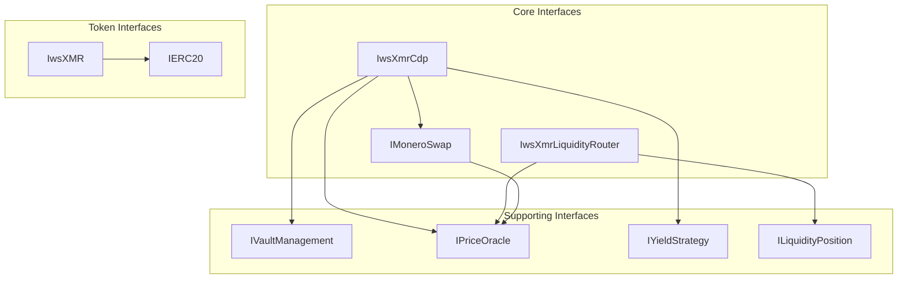
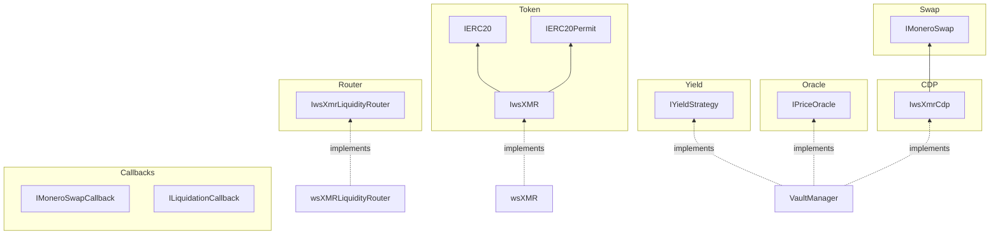

# wsXMR Interface Architecture

Breaking the contracts into well-defined interfaces improves composability, testing, and allows external integrators to interact with specific subsystems. Here's a comprehensive interface design:

## Interface Hierarchy Overview



---

## Core Interfaces

### IwsXMR.sol

```solidity
// SPDX-License-Identifier: LGPLv3
pragma solidity ^0.8.19;

import {IERC20} from "@openzeppelin/contracts/token/ERC20/IERC20.sol";
import {IERC20Permit} from "@openzeppelin/contracts/token/ERC20/extensions/IERC20Permit.sol";

/**
 * @title IwsXMR
 * @notice Interface for the wrapped synthetic Monero token
 * @dev Extends ERC20 with privileged mint/burn for the VaultManager
 */
interface IwsXMR is IERC20, IERC20Permit {
    /// @notice Address authorized to mint and burn tokens
    function vaultManager() external view returns (address);
    
    /// @notice Mint tokens to an address (only VaultManager)
    /// @param to Recipient address
    /// @param amount Amount to mint
    function mint(address to, uint256 amount) external;
    
    /// @notice Burn tokens from an address (only VaultManager)
    /// @param from Address to burn from
    /// @param amount Amount to burn
    function burn(address from, uint256 amount) external;
    
    /// @notice Token decimals (8 for wsXMR, matching XMR's piconero precision / 1e4)
    function decimals() external view returns (uint8);
    
    /// @dev Thrown when caller is not the VaultManager
    error OnlyVaultManager();
}
```

---

### IMoneroSwap.sol

```solidity
// SPDX-License-Identifier: LGPLv3
pragma solidity ^0.8.19;

/**
 * @title IMoneroSwap
 * @notice Interface for Monero atomic swap operations (mint and burn flows)
 * @dev Implements a cryptographic handshake using Ed25519 commitments
 */
interface IMoneroSwap {
    // ========== ENUMS ==========
    
    enum MintStatus {
        INVALID,
        PENDING,    // User initiated, waiting for LP
        READY,      // LP confirmed XMR lock on Monero
        COMPLETED,  // Secret revealed, wsXMR minted
        CANCELLED   // Timed out or invalidated
    }
    
    enum BurnStatus {
        INVALID,
        REQUESTED,  // wsXMR burned, collateral locked
        PROPOSED,   // LP proposed secretHash
        COMMITTED,  // User confirmed Monero lock
        COMPLETED,  // LP revealed secret
        SLASHED,    // LP failed to reveal, collateral seized
        CANCELLED   // Cancelled before commitment
    }
    
    // ========== STRUCTS ==========
    
    struct MintRequest {
        bytes32 requestId;
        address initiator;
        address recipient;
        address lpVault;
        uint256 xmrAmount;
        uint256 wsxmrAmount;
        uint256 feeAmount;
        bytes32 claimCommitment;
        uint256 timeout;
        uint256 griefingDeposit;
        uint256 normalizedDebtAmount;
        uint256 vaultMintNonce;
        MintStatus status;
    }
    
    struct BurnRequest {
        bytes32 requestId;
        address user;
        address lpVault;
        uint256 wsxmrAmount;
        uint256 xmrAmount;
        uint256 lockedCollateral;
        uint256 rewardCollateral;
        bytes32 secretHash;
        uint256 deadline;
        uint256 vaultLiquidationNonce;
        uint256 normalizedDebtAmount;
        BurnStatus status;
    }
    
    // ========== EVENTS ==========
    
    event MintInitiated(
        bytes32 indexed requestId,
        address indexed initiator,
        address indexed recipient,
        address lpVault,
        uint256 xmrAmount,
        uint256 wsxmrAmount,
        uint256 feeAmount,
        bytes32 claimCommitment,
        uint256 timeout
    );
    
    event LPKeyProvided(bytes32 indexed requestId, bytes32 lpPublicKey);
    event MintReady(bytes32 indexed requestId);
    event MintFinalized(bytes32 indexed requestId, bytes32 secret);
    event MintCancelled(bytes32 indexed requestId);
    
    event BurnRequested(
        bytes32 indexed requestId,
        address indexed user,
        address indexed lpVault,
        uint256 wsxmrAmount,
        uint256 xmrAmount,
        uint256 rewardCollateral
    );
    
    event HashProposed(bytes32 indexed requestId, bytes32 secretHash);
    event BurnCommitted(bytes32 indexed requestId, uint256 deadline);
    event BurnFinalized(bytes32 indexed requestId, bytes32 secret, uint256 rewardPaid);
    event BurnSlashed(bytes32 indexed requestId, address indexed user, uint256 collateralSeized);
    event BurnCancelled(bytes32 indexed requestId);
    
    // ========== ERRORS ==========
    
    error InvalidSecret();
    error InvalidStatus();
    error TimeoutNotReached();
    error DeadlineExpired();
    error DeadlineNotExpired();
    error MintAlreadyExists();
    error BurnAlreadyExists();
    error InsufficientDeposit();
    error BelowMinimumBurn();
    error MaxBurnRequestsReached();
    error OnlyUserCanInitiate();
    error GracePeriodOnlyUser();
    error BurnInvalidatedByLiquidation();
    
    // ========== MINT FUNCTIONS ==========
    
    /**
     * @notice Initiate a mint request
     * @param lpVault Address of the LP vault
     * @param recipient Address to receive wsXMR
     * @param xmrAmount Amount of XMR in atomic units (1e12)
     * @param claimCommitment Ed25519 commitment hash
     * @param timeoutDuration Seconds until timeout
     * @return requestId Unique identifier
     */
    function initiateMint(
        address lpVault,
        address recipient,
        uint256 xmrAmount,
        bytes32 claimCommitment,
        uint256 timeoutDuration
    ) external payable returns (bytes32 requestId);
    
    /**
     * @notice LP provides public key for atomic swap
     * @param requestId The mint request ID
     * @param lpPublicKey LP's Ed25519 public spend key
     */
    function provideLPKey(bytes32 requestId, bytes32 lpPublicKey) external;
    
    /**
     * @notice LP confirms XMR lock on Monero
     * @param requestId The mint request ID
     */
    function setMintReady(bytes32 requestId) external;
    
    /**
     * @notice Finalize mint with revealed secret
     * @param requestId The mint request ID
     * @param secret The secret revealed on Monero
     */
    function finalizeMint(bytes32 requestId, bytes32 secret) external;
    
    /**
     * @notice Cancel mint after timeout (permissionless)
     * @param requestId The mint request ID
     */
    function cancelMint(bytes32 requestId) external;
    
    // ========== BURN FUNCTIONS ==========
    
    /**
     * @notice Request burn of wsXMR for XMR
     * @param wsxmrAmount Amount of wsXMR to burn
     * @param lpVault LP vault to handle the burn
     * @param user Address whose wsXMR to burn
     * @return requestId Unique identifier
     */
    function requestBurn(
        uint256 wsxmrAmount,
        address lpVault,
        address user
    ) external returns (bytes32 requestId);
    
    /**
     * @notice LP proposes secret hash after locking XMR
     * @param requestId The burn request ID
     * @param secretHash Hash of LP's secret
     */
    function proposeHash(bytes32 requestId, bytes32 secretHash) external;
    
    /**
     * @notice User confirms Monero lock is valid
     * @param requestId The burn request ID
     */
    function confirmMoneroLock(bytes32 requestId) external;
    
    /**
     * @notice LP finalizes burn with secret
     * @param requestId The burn request ID
     * @param secret The secret to reveal
     */
    function finalizeBurn(bytes32 requestId, bytes32 secret) external;
    
    /**
     * @notice Claim slashed collateral after LP failure
     * @param requestId The burn request ID
     */
    function claimSlashedCollateral(bytes32 requestId) external;
    
    /**
     * @notice Cancel burn after timeout (permissionless)
     * @param requestId The burn request ID
     */
    function cancelBurn(bytes32 requestId) external;
    
    // ========== VIEW FUNCTIONS ==========
    
    function mintRequests(bytes32 requestId) external view returns (MintRequest memory);
    function burnRequests(bytes32 requestId) external view returns (BurnRequest memory);
    function lpPublicKeys(bytes32 requestId) external view returns (bytes32);
    function userMintRequests(address user, uint256 index) external view returns (bytes32);
    function userBurnRequests(address user, uint256 index) external view returns (bytes32);
}
```

---

### IwsXmrCdp.sol

```solidity
// SPDX-License-Identifier: LGPLv3
pragma solidity ^0.8.19;

import {IMoneroSwap} from "./IMoneroSwap.sol";

/**
 * @title IwsXmrCdp
 * @notice Interface for the Collateralized Debt Position (CDP) system
 * @dev Manages LP vaults, collateral, debt, and liquidations
 */
interface IwsXmrCdp is IMoneroSwap {
    // ========== STRUCTS ==========
    
    struct Vault {
        address lpAddress;
        uint256 collateralAmount;
        uint256 lockedCollateral;
        uint256 normalizedDebt;
        uint256 pendingDebt;
        uint16 maxMintBps;
        uint256 mintGriefingDeposit;
        uint16 mintFeeBps;
        uint16 burnRewardBps;
        uint256 liquidationNonce;
        uint256 mintNonce;
        uint256 minBurnAmount;
        bool active;
    }
    
    // ========== EVENTS ==========
    
    event VaultCreated(address indexed lpAddress, address indexed collateralAsset);
    event CollateralDeposited(address indexed lpAddress, address indexed asset, uint256 amount);
    event CollateralWithdrawn(address indexed lpAddress, address indexed asset, uint256 amount);
    event VaultMarketMetricsUpdated(address indexed lpVault, uint16 mintFeeBps, uint16 burnRewardBps);
    event VaultLiquidated(
        address indexed lpVault,
        address indexed liquidator,
        uint256 debtCleared,
        uint256 collateralSeized
    );
    event ReturnQueued(address indexed recipient, address indexed token, uint256 amount);
    event ReturnsWithdrawn(address indexed recipient, address indexed token, uint256 amount);
    
    // ========== ERRORS ==========
    
    error ZeroAddress();
    error ZeroAmount();
    error VaultAlreadyExists();
    error VaultDoesNotExist();
    error VaultNotActive();
    error InsufficientCollateral();
    error ExceedsMaxMargin();
    error InsufficientDebt();
    error VaultHealthy();
    error MaxVaultsReached();
    error CancelBurnsFirst();
    
    // ========== CONSTANTS ==========
    
    function COLLATERAL_RATIO() external view returns (uint256);
    function LIQUIDATION_RATIO() external view returns (uint256);
    function LIQUIDATION_BONUS() external view returns (uint256);
    
    // ========== VAULT MANAGEMENT ==========
    
    /**
     * @notice Create a new LP vault
     */
    function createVault() external;
    
    /**
     * @notice Deposit collateral (native token, auto-converts to yield-bearing)
     * @param amount Amount to deposit
     */
    function depositCollateral(uint256 amount) external;
    
    /**
     * @notice Deposit yield-bearing shares directly
     * @param shares Amount of shares to deposit
     */
    function depositSDAI(uint256 shares) external;
    
    /**
     * @notice Withdraw collateral if health ratio allows
     * @param amount Amount to withdraw
     */
    function withdrawCollateral(uint256 amount) external;
    
    /**
     * @notice Set griefing deposit required for mints
     * @param deposit ETH amount required
     */
    function setMintGriefingDeposit(uint256 deposit) external;
    
    /**
     * @notice Set mint fees and burn rewards
     * @param mintFeeBps Mint fee in basis points
     * @param burnRewardBps Burn reward in basis points
     */
    function setVaultMarketMetrics(uint16 mintFeeBps, uint16 burnRewardBps) external;
    
    /**
     * @notice Set maximum single mint size
     * @param maxMintBps Max mint as BPS of capacity
     */
    function setMaxMintBps(uint16 maxMintBps) external;
    
    /**
     * @notice Set minimum burn amount
     * @param minAmount Minimum wsXMR for burns
     */
    function setMinBurnAmount(uint256 minAmount) external;
    
    /**
     * @notice Withdraw queued returns (pull pattern)
     * @param token Token address (address(0) for ETH)
     */
    function withdrawReturns(address token) external;
    
    // ========== LIQUIDATION ==========
    
    /**
     * @notice Liquidate an undercollateralized vault
     * @param lpVault Address of vault to liquidate
     * @param debtToClear Amount of debt to clear
     */
    function liquidate(address lpVault, uint256 debtToClear) external;
    
    /**
     * @notice Check if vault is liquidatable
     * @param lpVault Address of vault
     * @return True if liquidatable
     */
    function isVaultLiquidatable(address lpVault) external view returns (bool);
    
    // ========== VIEW FUNCTIONS ==========
    
    function vaults(address lpAddress) external view returns (Vault memory);
    function getVaultDebt(address lpAddress) external view returns (uint256);
    function getVaultHealth(address lpAddress) external view returns (uint256);
    function getActualDebt(uint256 normalizedDebt) external view returns (uint256);
    function calculateCollateralRatio(
        uint256 collateralAmount,
        uint256 debtAmount
    ) external view returns (uint256);
    function getVaultCount() external view returns (uint256);
    function vaultList(uint256 index) external view returns (address);
    function pendingReturns(address user, address token) external view returns (uint256);
    function globalTotalDebt() external view returns (uint256);
    function globalDebtIndex() external view returns (uint256);
    function globalBadDebt() external view returns (uint256);
}
```

---

### IPriceOracle.sol

```solidity
// SPDX-License-Identifier: LGPLv3
pragma solidity ^0.8.19;

/**
 * @title IPriceOracle
 * @notice Interface for price oracle operations
 * @dev Abstracts the underlying oracle implementation (Pyth, Chainlink, etc.)
 */
interface IPriceOracle {
    // ========== ERRORS ==========
    
    error StalePrice();
    error PriceNormalizedToZero();
    error RefundFailed();
    
    // ========== FUNCTIONS ==========
    
    /**
     * @notice Get XMR price in USD with default staleness
     * @return price Price normalized to 18 decimals
     */
    function getXmrPrice() external view returns (uint256 price);
    
    /**
     * @notice Get XMR price with custom staleness window
     * @param maxAge Maximum acceptable age in seconds
     * @return price Price normalized to 18 decimals
     */
    function getXmrPriceWithAge(uint256 maxAge) external view returns (uint256 price);
    
    /**
     * @notice Get collateral price in USD with default staleness
     * @return price Price normalized to 18 decimals
     */
    function getCollateralPrice() external view returns (uint256 price);
    
    /**
     * @notice Get collateral price with custom staleness window
     * @param maxAge Maximum acceptable age in seconds
     * @return price Price normalized to 18 decimals
     */
    function getCollateralPriceWithAge(uint256 maxAge) external view returns (uint256 price);
    
    /**
     * @notice Update oracle price feeds (push-based oracles)
     * @param updateData Signed price update data
     */
    function updatePythPrices(bytes[] calldata updateData) external payable;
    
    /**
     * @notice Get the oracle update fee
     * @param updateData Price update data
     * @return fee Required fee in native token
     */
    function getUpdateFee(bytes[] calldata updateData) external view returns (uint256 fee);
    
    // ========== CONSTANTS ==========
    
    function PRICE_MAX_AGE() external view returns (uint256);
    function XMR_USD_FEED_ID() external view returns (bytes32);
    function SDAI_USD_FEED_ID() external view returns (bytes32);
}
```

---

### IYieldStrategy.sol

```solidity
// SPDX-License-Identifier: LGPLv3
pragma solidity ^0.8.19;

/**
 * @title IYieldStrategy
 * @notice Interface for yield generation and buy-and-burn mechanics
 * @dev Manages yield war chest and debt reduction
 */
interface IYieldStrategy {
    // ========== EVENTS ==========
    
    event YieldHarvested(uint256 yieldInDAI, uint256 yieldInShares);
    event BadDebtWrittenOff(address indexed lpVault, uint256 debtAmount);
    event BuyAndBurnExecuted(
        uint256 sDAISpent,
        uint256 wsxmrBurned,
        uint256 keeperReward,
        uint256 newGlobalDebtIndex
    );
    
    // ========== ERRORS ==========
    
    error InvalidPoolFeeTier();
    error CooldownActive();
    error InvalidSpotPrice();
    error InvalidEMAPrice();
    error PriceExponentMismatch();
    error XMRNotDipped();
    error WarChestEmpty();
    
    // ========== FUNCTIONS ==========
    
    /**
     * @notice Execute buy-and-burn when conditions are met
     * @param poolFeeTier DEX fee tier to route through
     */
    function triggerBuyAndBurn(uint24 poolFeeTier) external;
    
    // ========== VIEW FUNCTIONS ==========
    
    function yieldWarChest() external view returns (uint256);
    function lastBuyTimestamp() external view returns (uint256);
    function allowedPoolFeeTiers(uint24 tier) external view returns (bool);
    function lpPrincipalDeposits(address lp) external view returns (uint256);
    function lpPrincipalShares(address lp) external view returns (uint256);
    function globalLpPrincipal() external view returns (uint256);
    function globalLpPrincipalShares() external view returns (uint256);
    
    // ========== CONSTANTS ==========
    
    function COOLDOWN_PERIOD() external view returns (uint256);
    function BUY_CHUNK_PERCENT() external view returns (uint256);
    function EMA_TRIGGER_THRESHOLD() external view returns (uint256);
}
```

---

### IwsXmrLiquidityRouter.sol

```solidity
// SPDX-License-Identifier: LGPLv3
pragma solidity ^0.8.19;

/**
 * @title IwsXmrLiquidityRouter
 * @notice Interface for the co-LP matchmaking system
 * @dev Pairs LP collateral with user wsXMR for DEX liquidity
 */
interface IwsXmrLiquidityRouter {
    // ========== STRUCTS ==========
    
    struct LiquidityPosition {
        uint256 positionId;
        address lpProvider;
        address userProvider;
        uint256 sDAIAmount;
        uint256 wsxmrAmount;
        uint256 lpInitialValueUSD;
        uint256 userInitialValueUSD;
        uint256 createdAt;
    }
    
    // ========== EVENTS ==========
    
    event LiquidityAllocated(address indexed lp, uint256 sDAIAmount);
    event LiquidityDeallocated(address indexed lp, uint256 sDAIAmount);
    event UserDepositedWsxmr(address indexed user, uint256 amount);
    event UserWithdrewWsxmr(address indexed user, uint256 amount);
    event WsxmrDeallocated(address indexed account, uint256 amount);
    
    event LpApprovedUser(address indexed lp, address indexed user, uint256 amount);
    event UserApprovedLp(address indexed user, address indexed lp, uint256 amount);
    
    event PositionCreated(
        uint256 indexed positionIndex,
        uint256 uniswapTokenId,
        address indexed lp,
        address indexed user,
        uint256 sDAIAmount,
        uint256 wsxmrAmount
    );
    event PositionClosed(uint256 indexed positionIndex, uint256 sDAIReturned, uint256 wsxmrReturned);
    event FeesCollected(uint256 indexed positionIndex, uint256 sDAIFees, uint256 wsxmrFees);
    event FeesWithdrawn(address indexed recipient, uint256 sDAIAmount, uint256 wsxmrAmount);
    
    event ILSDAICredited(address indexed user, uint256 amount, uint256 positionIndex);
    event ILWsxmrCredited(address indexed lp, uint256 amount, uint256 positionIndex);
    
    event PoolInitialized(address indexed pool, uint160 sqrtPriceX96, uint256 sDAIPrice, uint256 wsxmrPrice);
    
    // ========== ERRORS ==========
    
    error Unauthorized();
    error InvalidAmount();
    error InsufficientBalance();
    error PositionNotFound();
    error VaultNotActive();
    
    // ========== POOL INITIALIZATION ==========
    
    /**
     * @notice Initialize the DEX pool with oracle-derived price
     * @param pythUpdateData Price update data
     * @return pool Address of the initialized pool
     */
    function initializePool(bytes[] calldata pythUpdateData) external payable returns (address pool);
    
    // ========== LP FUNCTIONS ==========
    
    /**
     * @notice LP allocates collateral for liquidity provision
     * @param sDAIAmount Amount of sDAI shares to allocate
     */
    function allocateLiquidity(uint256 sDAIAmount) external;
    
    /**
     * @notice Withdraw sDAI balance
     * @param sDAIAmount Amount to withdraw
     */
    function withdrawSDAI(uint256 sDAIAmount) external;
    
    // ========== USER FUNCTIONS ==========
    
    /**
     * @notice User deposits wsXMR for liquidity provision
     * @param amount Amount of wsXMR to deposit
     */
    function depositWsxmr(uint256 amount) external;
    
    /**
     * @notice Withdraw wsXMR balance
     * @param wsxmrAmount Amount to withdraw
     */
    function withdrawWsXMR(uint256 wsxmrAmount) external;
    
    /**
     * @notice Burn wsXMR from internal balance to reduce vault debt
     * @param wsxmrAmount Amount to burn
     * @param lpVault LP vault to handle the burn
     * @return requestId Burn request identifier
     */
    function burnFromInternalBalance(
        uint256 wsxmrAmount,
        address lpVault
    ) external returns (bytes32 requestId);
    
    /**
     * @notice Withdraw pending ETH refunds
     */
    function withdrawETH() external;
    
    // ========== APPROVAL FUNCTIONS ==========
    
    /**
     * @notice LP increases approval for a user
     * @param user Address of user
     * @param additionalSDAI Additional sDAI to approve
     */
    function increaseUserApproval(address user, uint256 additionalSDAI) external;
    
    /**
     * @notice LP decreases approval for a user
     * @param user Address of user
     * @param reduceSDAI Amount to reduce
     */
    function decreaseUserApproval(address user, uint256 reduceSDAI) external;
    
    /**
     * @notice User increases approval for an LP
     * @param lp Address of LP
     * @param additionalWsxmr Additional wsXMR to approve
     */
    function increaseLpApproval(address lp, uint256 additionalWsxmr) external;
    
    /**
     * @notice User decreases approval for an LP
     * @param lp Address of LP
     * @param reduceWsxmr Amount to reduce
     */
    function decreaseLpApproval(address lp, uint256 reduceWsxmr) external;
    
    // ========== POSITION MANAGEMENT ==========
    
    /**
     * @notice Create position with price update
     * @param lp LP providing sDAI
     * @param user User providing wsXMR
     * @param sDAIAmount Amount of sDAI
     * @param wsxmrAmount Amount of wsXMR
     * @param deadline Transaction deadline
     * @param pythUpdateData Price update data
     * @return positionIndex Index of created position
     */
    function createPositionWithPriceUpdate(
        address lp,
        address user,
        uint256 sDAIAmount,
        uint256 wsxmrAmount,
        uint256 deadline,
        bytes[] calldata pythUpdateData
    ) external payable returns (uint256 positionIndex);
    
    /**
     * @notice Create position without price update
     * @param lp LP providing sDAI
     * @param user User providing wsXMR
     * @param sDAIAmount Amount of sDAI
     * @param wsxmrAmount Amount of wsXMR
     * @param deadline Transaction deadline
     * @return positionIndex Index of created position
     */
    function createPosition(
        address lp,
        address user,
        uint256 sDAIAmount,
        uint256 wsxmrAmount,
        uint256 deadline
    ) external returns (uint256 positionIndex);
    
    /**
     * @notice Close a liquidity position
     * @param positionIndex Index of position
     * @param deadline Transaction deadline
     * @param minTotalValueUSD Minimum USD value to receive
     */
    function closePosition(
        uint256 positionIndex,
        uint256 deadline,
        uint256 minTotalValueUSD
    ) external;
    
    /**
     * @notice Collect fees from active position
     * @param positionIndex Index of position
     */
    function collectFees(uint256 positionIndex) external;
    
    /**
     * @notice Withdraw accumulated fees
     */
    function withdrawFees() external;
    
    // ========== VIEW FUNCTIONS ==========
    
    function getPosition(uint256 positionIndex) external view returns (LiquidityPosition memory);
    function getLpAvailableLiquidity(address lp) external view returns (uint256);
    function getUserAvailableWsxmr(address user) external view returns (uint256);
    
    function getWithdrawableBalances(address account) external view returns (
        uint256 sDAIBalance,
        uint256 wsxmrBalance,
        uint256 sDAIFees,
        uint256 wsxmrFees
    );
    
    function getUserPositions(
        address account,
        uint256 cursor,
        uint256 limit
    ) external view returns (
        LiquidityPosition[] memory activePositions,
        uint256 nextCursor
    );
    
    function lpLiquidityAllocation(address lp) external view returns (uint256);
    function userWsxmrDeposits(address user) external view returns (uint256);
    function lpApprovalAmount(address lp, address user) external view returns (uint256);
    function userApprovalAmount(address user, address lp) external view returns (uint256);
    function pendingSDAIFees(address account) external view returns (uint256);
    function pendingWsxmrFees(address account) external view returns (uint256);
    function pendingETHRefunds(address account) external view returns (uint256);
    function activePositionCount(address account) external view returns (uint256);
    function poolInitialized() external view returns (bool);
    
    // ========== CONSTANTS ==========
    
    function POOL_FEE() external view returns (uint24);
    function MIN_DEPOSIT_AMOUNT() external view returns (uint256);
    function MIN_POSITION_DURATION() external view returns (uint256);
    function MAX_ACTIVE_POSITIONS_PER_USER() external view returns (uint256);
}
```

---

## Callback Interfaces

### IMoneroSwapCallback.sol

```solidity
// SPDX-License-Identifier: LGPLv3
pragma solidity ^0.8.19;

/**
 * @title IMoneroSwapCallback
 * @notice Callback interface for external integrations with atomic swaps
 * @dev Implement this to receive notifications about swap state changes
 */
interface IMoneroSwapCallback {
    /**
     * @notice Called when a mint request is ready for finalization
     * @param requestId The mint request ID
     * @param lpVault The LP vault handling the mint
     * @param wsxmrAmount Amount of wsXMR to be minted
     */
    function onMintReady(
        bytes32 requestId,
        address lpVault,
        uint256 wsxmrAmount
    ) external;
    
    /**
     * @notice Called when a burn request needs LP action
     * @param requestId The burn request ID
     * @param user The user requesting the burn
     * @param xmrAmount Amount of XMR to be sent
     */
    function onBurnRequested(
        bytes32 requestId,
        address user,
        uint256 xmrAmount
    ) external;
    
    /**
     * @notice Called when a burn has been committed by user
     * @param requestId The burn request ID
     * @param deadline Deadline for LP to reveal secret
     */
    function onBurnCommitted(
        bytes32 requestId,
        uint256 deadline
    ) external;
}
```

---

### ILiquidationCallback.sol

```solidity
// SPDX-License-Identifier: LGPLv3
pragma solidity ^0.8.19;

/**
 * @title ILiquidationCallback
 * @notice Callback interface for flash liquidations
 * @dev Implement for integration with flash loan protocols
 */
interface ILiquidationCallback {
    /**
     * @notice Called during liquidation to allow flash loan repayment
     * @param lpVault The vault being liquidated
     * @param debtCleared Amount of debt being cleared
     * @param collateralReceived Amount of collateral being received
     * @param data Arbitrary data passed through
     */
    function onLiquidation(
        address lpVault,
        uint256 debtCleared,
        uint256 collateralReceived,
        bytes calldata data
    ) external;
}
```

---

## Full Contract Interface Inheritance



---

## Usage Examples

### Integrating as an LP Bot

```solidity
// SPDX-License-Identifier: MIT
pragma solidity ^0.8.19;

import {IwsXmrCdp} from "./interfaces/IwsXmrCdp.sol";
import {IMoneroSwapCallback} from "./interfaces/IMoneroSwapCallback.sol";

contract LPBot is IMoneroSwapCallback {
    IwsXmrCdp public immutable cdp;
    
    constructor(address _cdp) {
        cdp = IwsXmrCdp(_cdp);
    }
    
    function onBurnRequested(
        bytes32 requestId,
        address user,
        uint256 xmrAmount
    ) external override {
        // Bot logic to lock XMR on Monero
        // Then call cdp.proposeHash(requestId, secretHash)
    }
    
    function onBurnCommitted(
        bytes32 requestId,
        uint256 deadline
    ) external override {
        // Bot logic to reveal secret before deadline
        // Call cdp.finalizeBurn(requestId, secret)
    }
}
```

### Querying Liquidation Opportunities

```solidity
// SPDX-License-Identifier: MIT
pragma solidity ^0.8.19;

import {IwsXmrCdp} from "./interfaces/IwsXmrCdp.sol";

contract LiquidationScanner {
    IwsXmrCdp public immutable cdp;
    
    constructor(address _cdp) {
        cdp = IwsXmrCdp(_cdp);
    }
    
    function findLiquidatableVaults(
        uint256 startIndex,
        uint256 count
    ) external view returns (address[] memory) {
        uint256 total = cdp.getVaultCount();
        uint256 end = startIndex + count > total ? total : startIndex + count;
        
        address[] memory candidates = new address[](count);
        uint256 found = 0;
        
        for (uint256 i = startIndex; i < end; i++) {
            address vault = cdp.vaultList(i);
            if (cdp.isVaultLiquidatable(vault)) {
                candidates[found++] = vault;
            }
        }
        
        // Trim array
        assembly {
            mstore(candidates, found)
        }
        
        return candidates;
    }
}
```

---

## Interface File Structure

```
contracts/
├── interfaces/
│   ├── IwsXMR.sol
│   ├── IMoneroSwap.sol
│   ├── IwsXmrCdp.sol
│   ├── IPriceOracle.sol
│   ├── IYieldStrategy.sol
│   ├── IwsXmrLiquidityRouter.sol
│   ├── callbacks/
│   │   ├── IMoneroSwapCallback.sol
│   │   └── ILiquidationCallback.sol
│   └── external/
│       ├── INonfungiblePositionManager.sol
│       ├── IUniswapV3Factory.sol
│       ├── IUniswapV3Pool.sol
│       ├── ISwapRouter.sol
│       └── ISavingsDAI.sol
├── wsXMR.sol
├── VaultManager.sol
├── wsXMRLiquidityRouter.sol
└── libraries/
    ├── CollateralLogic.sol
    ├── YieldLogic.sol
    └── BurnLogic.sol
```

This interface architecture provides:

- **Separation of Concerns**: Each interface handles a specific domain
- **Composability**: External protocols can integrate with specific subsystems
- **Testability**: Mock implementations can be created for each interface
- **Upgradeability Path**: Future implementations can conform to same interfaces
- **Documentation**: NatSpec comments on interfaces serve as API docs
