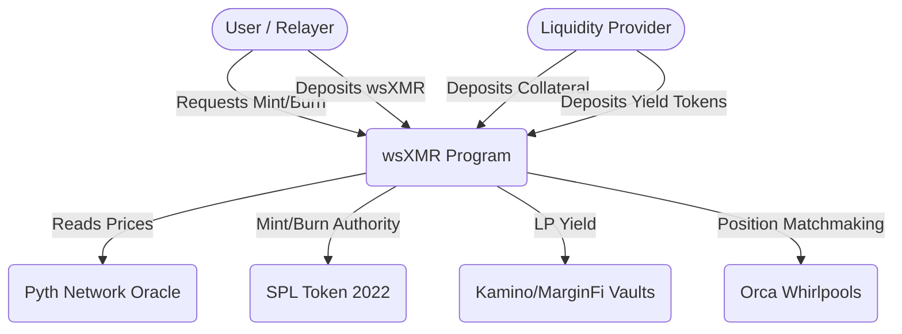

This document outlines the detailed technical specification for porting the Wrapsynth Monero (wsXMR) protocol to Solana using the Anchor framework. The architecture transitions from EVM's shared-state contract to a highly parallelized, Account-based architecture utilizing Program Derived Addresses (PDAs) for state isolation.

## System Architecture

The protocol operates via two primary modules executed within a single Anchor program, interacting with external primitive programs (SPL Token, Pyth Oracle, and Concentrated Liquidity AMMs like Whirlpools or Meteora).



## State Accounts (PDAs)

Solana isolates state into separate accounts. The global variables and mapping structures from the EVM version are converted into the following PDAs.

### Global State (`GlobalState`)

Tracks systemic debt, protocol accumulated yield, and holds the mint authority for the wsXMR SPL Token.

- Seeds:`[b"global_state"]`

| Field | Type | Description |
|---|---|---|
| mint_authority_bump | u8 | Bump seed for the token mint authority PDA |
| global_debt_index | u64 | Multiplier for scaling normalized debt (starts at 1e18) |
| yield_war_chest | u64 | Accumulated yield tokens ready for buy-and-burn |
| global_lp_principal | u64 | Global sum of LP principal to avoid O(N) loops |
| last_buy_timestamp | i64 | Cooldown tracking for strategy execution |
| price_max_age | u64 | Configurable staleness threshold for Pyth oracles |

### Vault Account (`Vault`)

Represents an individual Liquidity Provider's Collateralized Debt Position (CDP).

- Seeds:`[b"vault", lp_pubkey.key().as_ref(), collateral_mint.key().as_ref()]`

| Field | Type | Description |
|---|---|---|
| lp_address | Pubkey | Wallet address of the Liquidity Provider |
| collateral_mint | Pubkey | The SPL token mint used as collateral (e.g., Kamino kToken) |
| collateral_amount | u64 | Total collateral deposited (in SPL token base units) |
| locked_collateral | u64 | Collateral immobilized backing active burn requests |
| normalized_debt | u64 | Vault debt scaled by the global debt index |
| pending_debt | u64 | Reserved capacity for active mint requests |
| lp_principal | u64 | Original deposit value tracked for yield harvesting |
| mint_fee_bps | u16 | Fee fraction charged by LP to user for minting |
| burn_reward_bps | u16 | Reward fraction paid to user for burning |
| max_mint_bps | u16 | Max percentage of vault capacity allowed per mint request |
| mint_griefing_deposit | u64 | Native SOL deposit required to initialize a mint |
| active | bool | Whether the vault is open and operational |

### Mint Request (`MintRequest`)

Tracks the state of a user's request to mint wsXMR after locking native XMR.

- Seeds:`[b"mint_request", request_id.as_ref()]`

| Field | Type | Description |
|---|---|---|
| request_id | [u8;32] | Unique identifier (hash of parameters and timestamp) |
| lp_vault | Pubkey | The Vault PDA fulfilling this mint |
| initiator | Pubkey | Wallet that paid the SOL griefing deposit |
| recipient | Pubkey | Destination SPL Token account for wsXMR tokens |
| wsxmr_amount | u64 | Quantity of wsXMR to mint (8 decimals) |
| fee_amount | u64 | Portion of wsXMR routed to the LP |
| claim_commitment | [u8;32] | Hash of the secret the LP must reveal |
| timeout | i64 | Unix timestamp when the request can be cancelled |
| griefing_deposit | u64 | Amount of native SOL locked to prevent spam |
| status | u8 | Enum (0: Invalid, 1: Pending, 2: Ready, 3: Completed, 4: Cancelled) |

### Burn Request (`BurnRequest`)

Manages the 3-step handshake for converting wsXMR back to native Monero.

- Seeds:`[b"burn_request", request_id.as_ref()]`

| Field | Type | Description |
|---|---|---|
| request_id | [u8;32] | Unique identifier for the burn operation |
| user | Pubkey | The user returning wsXMR |
| lp_vault | Pubkey | The Vault PDA handling the release of XMR |
| wsxmr_amount | u64 | Amount of wsXMR tokens burned |
| locked_collateral | u64 | Base collateral reserved until handshake completes |
| reward_collateral | u64 | Bonus collateral provided by LP to incentivize burn |
| secret_hash | [u8;32] | Hash proposed by LP during the Monero network lock |
| deadline | i64 | Unix timestamp dictating slashing timeouts |
| status | u8 | Enum (0: Invalid, 1: Requested, 2: Proposed, 3: Committed, 4: Completed, 5: Slashed) |

## Cryptography & Native Computations

Unlike Solidity where the protocol abuses`ecrecover` to achieve secp256k1 point multiplication, Solana allows compilation of standard Rust cryptographic crates directly into the BPF format.

The Anchor program must implement the`mulVerify` step natively utilizing the`k256` crate. This routine checks if a revealed secret $s$ matches a commitment point $Q$ such that $Q = s \cdot G$.

```rust
use k256::{elliptic_curve::sec1::ToEncodedPoint, ProjectivePoint, Scalar};
use anchor_lang::solana_program::hash::hash;

pub fn verify_secret_commitment(secret: &[u8; 32], commitment: &[u8; 32]) -> bool {
    // Reduce secret to a scalar on the secp256k1 curve
    let scalar_secret = Scalar::from_bytes_reduced(&secret.into());
    
    // Perform Generator * scalar multiplication
    let expected_point = (ProjectivePoint::GENERATOR * scalar_secret).to_affine();
    
    // Hash the resulting compressed encoded point
    let encoded_point = expected_point.to_encoded_point(false);
    let point_hash = hash(encoded_point.as_bytes());
    
    point_hash.to_bytes() == *commitment
}
```

## Oracle Integration

Because Pyth V2 follows a pull-oracle model, prices must be pushed in the same transaction or immediately prior to CDP logic. The program utilizes the`pyth_solana_receiver_sdk` crate.

Instead of hardcoded constants, feed IDs are verified dynamically via an administration configuration. Confidence interval checks are strictly enforced.

```rust
// Verify confidence is not wider than 10% of the price
let price_msg = pyth_oracle.get_price_no_older_than(
    &clock,
    global_state.price_max_age,
    &feed_id,
)?;
require!(
    price_msg.conf.checked_mul(10).unwrap() <= price_msg.price.try_into().unwrap(),
    ErrorCode::OracleConfidenceTooWide
);
```

## Mathematical Models

Solana does not support native floating-point math safely. All ratio and debt calculations utilize fixed-point math cast to`u128` to prevent calculation overflows during decimal normalizations.

### Normalized Debt

Global debt distribution leverages an exact index logic to handle protocol-wide buy-and-burn evenly across all active vaults in O(1) time complexity.

$$
\text{Actual Debt} = \frac{\text{Normalized Debt} \times \text{Global Debt Index}}{10^{18}}
$$

### Collateralization Ratio

To calculate vault health, token values must be strictly aligned by decimal differences (e.g., wsXMR uses 8 decimals, collateral may use 6 or 9).

$$
\text{Ratio} = \frac{\text{Collateral Amount} \times \text{CollPrice}_{\text{USD}} \times 10^{\text{wsxmr\_decimals}} \times 100}{\text{Actual Debt} \times \text{XmrPrice}_{\text{USD}} \times 10^{\text{coll\_decimals}}}
$$

## Core Instructions

The program defines the following major instruction handlers:

###`initialize_global`
Bootstraps the`GlobalState` PDA, configuring Pyth constraints and assigning the SPL Token Mint authority.

###`create_vault` &`deposit_collateral`
Instantiates a new`Vault` PDA. The deposit logic transitions standard SPL tokens into a supported yield aggregator (e.g., Kamino) via CPI, logging the exact returned vault shares as`collateral_amount`.

###`initiate_mint`
- Verifies Vault health bounds inclusive of the proposed mint.
- Requires user to transfer native SOL to the`MintRequest` PDA as a griefing deposit.
- Adds to Vault`pending_debt`.
- Requires updated Oracle accounts passed dynamically.

###`finalize_mint`
- Validates the provided secret via secp256k1 curve multiplication against`MintRequest.claim_commitment`.
- Performs CPI to the SPL Token Program to mint wsXMR.
- Shifts`pending_debt` into`normalized_debt` by dividing actual debt by the`global_debt_index`.
- Yield extraction fires implicitly, subtracting surplus vault shares and augmenting`yield_war_chest`.

###`request_burn`
- Allows standard users or Meta-TX relayers (via Token-2022 delegation) to burn wsXMR.
- Validates current Oracle pricing to lock the corresponding`locked_collateral`.
- The wsXMR is burned via CPI immediately taking it out of circulation while the XMR bridging relies on LP fulfillment.

###`finalize_burn` /`claim_slashed_collateral`
- If successful, Vault locked collateral unwinds and user rewards are unlocked.
- If LP timeouts expire after the Monero network lock confirmation, the PDA allows the user to seize the`locked_collateral` directly to their SPL Token account.

###`liquidate`
- Accessible permissionlessly by keeper bots.
- Reads`GlobalState` to map`actual_debt` and verifies collateralization ratio falls below`120`.
- Burns liquidator's wsXMR SPL tokens and transfers Vault SPL collateral chunks at a 10% premium.

## Error Codes

Custom errors must be explicitly mapped within the Anchor macro to ensure adequate frontend debugging.

| Code | Name | Description |
|---|---|---|
| 6000 | MathOverflow | A computational overflow boundary was hit in u128 downcasting |
| 6001 | VaultNotActive | The selected Vault PDA is disabled or uninitialized |
| 6002 | InsufficientCollateral | Operation rejected: Vault Health drops below collateralization ratio |
| 6003 | OracleConfidenceTooWide | Pyth price feed confidence interval exceeds 10% risk variance |
| 6004 | OraclePriceStale | Pyth Price Update PDA exceeds maximum age timestamp |
| 6005 | InvalidSecret | Provided key fails secp256k1 multiplier validation |
| 6006 | Unauthorized | Signer does not match the associated LP or User record |
| 6007 | DeadlineNotReached | Attempted to cancel Request PDA before SLA timeout |
| 6008 | ExceedsMaxMintBounds | Mint requested surpasses Vault LP configuration thresholds |