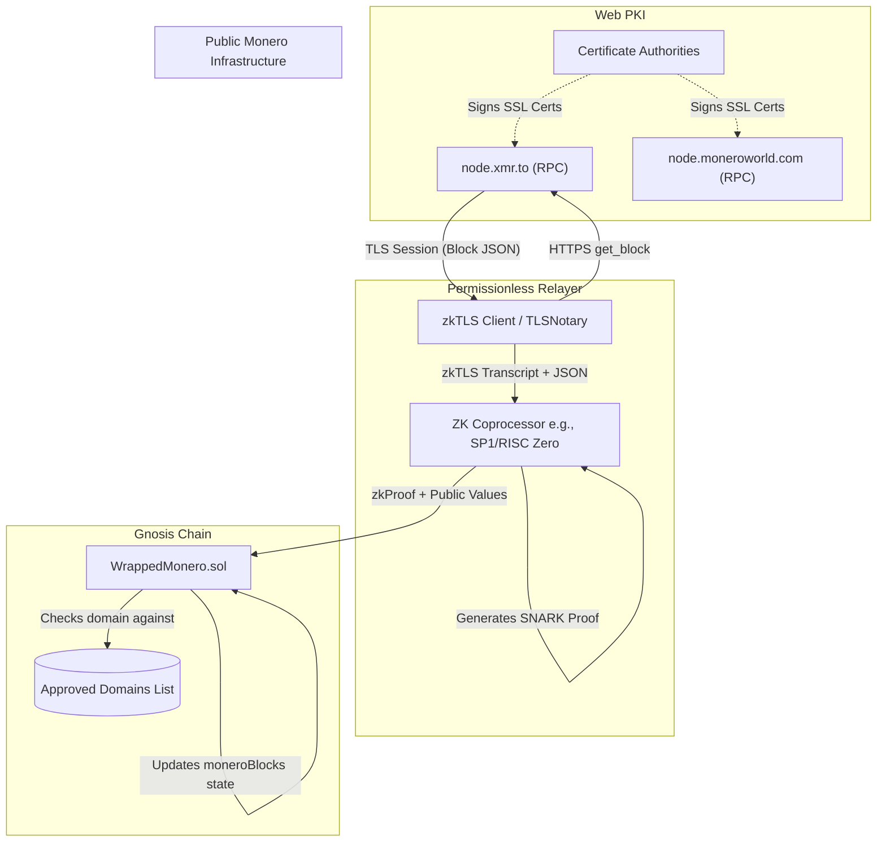

# Specification: Decentralized zkTLS Oracle for Wrapsynth Monero

## 1. Overview

This document specifies the architecture for a permissionless, decentralized oracle system for the`WrappedMonero.sol` smart contract on Gnosis Chain.

Due to the immense memory requirements of Monero's RandomX Proof-of-Work algorithm, verifying Monero consensus entirely within a Zero-Knowledge Virtual Machine (zkVM) is currently technically impractical. To achieve decentralization without modifying Monero's infrastructure or relying on permissioned multisigs, this architecture utilizes **zkTLS** (Zero-Knowledge Transport Layer Security) combined with a **ZK Coprocessor**.

This system allows any permissionless actor (a "Relayer") to query public Monero RPC nodes, cryptographically prove the server's response via TLS, and utilize a lightweight zkVM to compute the necessary output Merkle trees required by the Wrapsynth protocol.

---

## 2. Architecture & Control Flow



---

## 3. Off-Chain Components

### 3.1 zkTLS Protocol Integration
The Relayer uses a zkTLS client (e.g., TLSNotary or Reclaim Protocol) to establish a secure HTTP connection to an approved Monero node.

* **Target Endpoint**:`https://<domain_name>:<port>/json_rpc`
* **Target Method**:`get_block`
* **Output**: A cryptographically signed transcript proving that a server holding the valid SSL certificate for`<domain_name>` transmitted a specific JSON response body.

### 3.2 ZK Coprocessor (Rust Guest Program)
The zkTLS transcript is inherently tied to a large JSON payload. Because parsing large JSONs and computing hundreds of Keccak256 hashes inside the EVM is prohibitively expensive, this computation is offloaded to a zkVM.

The zkVM executes a deterministic Rust program that performs the following steps:

1. **Verify zkTLS Proof**: Validate the TLS certificate chain against standard Web PKI roots, ensuring the`domain_name` is authentic and the JSON response was not tampered with.
2. **Extract JSON Payload**: Parse the`get_block` JSON response.
3. **Extract Block Header Data**:
   *`block_height`
   *`block_hash`
   *`tx_merkle_root` (Standard Monero TX tree)
4. **Construct Custom Output Merkle Tree**:
   * Iterate through the`miner_tx` and all`tx_hashes` in the block.
   * For each transaction, iterate through its`vout` (outputs).
   * For each output, extract:`txHash`,`outputIndex`,`ecdhAmount`,`outputPubKey`, and`commitment`.
   * Compute the leaf hash matches the Wrapsynth`mint` requirement:
```rust
     // Pseudocode logic applied in zkVM
     let leaf = keccak256_concat(txHash, outputIndex, ecdhAmount, outputPubKey, commitment);
     ```
   * Construct a complete SHA256 or Keccak256 binary Merkle tree from these leaves.
   * Extract the root as`output_merkle_root`.
5. **Commit Public Values**: Output the serialized verification parameters.

**Guest Program Public Output struct:**
```rust
struct PublicValues {
    pub domain_name: [u8; 32],      // e.g. "node.xmr.to" (padded)
    pub block_height: u64,
    pub block_hash: [u8; 32],
    pub tx_merkle_root: [u8; 32],
    pub output_merkle_root: [u8; 32],
}
```

---

## 4. On-Chain Smart Contract Updates

The`WrappedMonero.sol` contract drops the`onlyOracle` modifier entirely, transitioning to a permissionless validation model based on zk-SNARK verification and a decentralized Domain Registry.

### 4.1 State Variables

```solidity
// ZK Verifier contract address (e.g., SP1 Verifier on Gnosis)
address public immutable zkVerifier;
// The keccak256 hash of the compiled Rust Coprocessor program
bytes32 public immutable processBlockImageId;

// Registry of trusted public Monero RPC domains
mapping(bytes32 => bool) public approvedDomains;

event DomainApproved(string domain, bytes32 domainHash);
event DomainRemoved(string domain, bytes32 domainHash);
```

### 4.2 Governance Functionality
The contract owner (or DAO) manages the list of approved domains. This protects the protocol from malicious endpoints while maintaining decentralization across multiple independent infrastructure providers.

```solidity
/**
 * @notice Approves a public Monero node domain for zkTLS queries
 * @param domain The strict domain string (e.g. "node.xmr.to")
 */
function approveDomain(string calldata domain) external onlyOwner {
    bytes32 domainHash = keccak256(abi.encodePacked(domain));
    approvedDomains[domainHash] = true;
    emit DomainApproved(domain, domainHash);
}

function removeDomain(string calldata domain) external onlyOwner {
    bytes32 domainHash = keccak256(abi.encodePacked(domain));
    approvedDomains[domainHash] = false;
    emit DomainRemoved(domain, domainHash);
}
```

### 4.3 Permissionless Block Relay
The`postMoneroBlock` function is updated to be callable by anyone, provided they supply a valid ZK proof.

```solidity
/**
 * @notice Permissionlessly post a Monero block proven via zkTLS & zkVM
 * @param zkProof The SNARK proof (Groth16/PLONK) generated by the zkVM
 * @param publicValues Serialized output of the zkVM execution
 */
function postMoneroBlock(
    bytes calldata zkProof,
    bytes calldata publicValues
) external nonReentrant {
    
    // 1. Verify the SNARK proof mathematically guarantees the Rust program executed correctly
    require(
        IZkVerifier(zkVerifier).verify(zkProof, processBlockImageId, sha256(publicValues)),
        "Invalid ZK proof"
    );

    // 2. Decode the Public Values securely committed by the zkVM
    (
        bytes32 domainHash,
        uint256 blockHeight,
        bytes32 blockHash,
        bytes32 txMerkleRoot,
        bytes32 outputMerkleRoot
    ) = abi.decode(publicValues, (bytes32, uint256, bytes32, bytes32, bytes32));

    // 3. Verify the source of the data
    require(approvedDomains[domainHash], "Data sourced from unapproved domain");

    // 4. Verify chain progression
    require(blockHeight > latestMoneroBlock, "Height must increase");
    require(!moneroBlocks[blockHeight].exists, "Block already exists");

    // 5. Update protocol state
    moneroBlocks[blockHeight] = MoneroBlockData({
        blockHash: blockHash,
        txMerkleRoot: txMerkleRoot,
        outputMerkleRoot: outputMerkleRoot,
        timestamp: block.timestamp,
        exists: true
    });
    
    latestMoneroBlock = blockHeight;

    // 6. Economics: Reward the permissionless relayer
    _distributeRelayerYield(msg.sender);

    emit MoneroBlockPosted(blockHeight, blockHash);
}
```

---

## 5. Security Mitigations

### 5.1 DNS Hijacking & Malicious RPCs
**Risk:** If a domain on the`approvedDomains` list is compromised, a malicious actor could return a fake JSON block creating a fake`outputMerkleRoot`, allowing them to mint unbacked wsXMR.
**Mitigation:**
1. Maintain a heavily curated list of reliable community nodes.
2. **Future Protocol Upgrade (M-of-N zkTLS):** The zkVM Coprocessor can be updated to require the Relayer to provide zkTLS transcripts mapping to *three different approved domains*. The zkVM will only generate the valid SNARK proof if the JSON bodies of all three nodes are strictly identical, effectively creating a decentralized consensus check of public RPCs.

### 5.2 Chain Reorganizations
**Risk:** Monero frequently experiences 1 to 3 block shallow reorgs.
**Mitigation:** The current smart contract logic strictly requires`blockHeight > latestMoneroBlock`. If a reorg occurs, relayers cannot override the existing block height.
*Fix*: Refactor`moneroBlocks` to map by`blockHash` instead of`blockHeight`, allowing parallel forks to be posted. Update the`mint` and`fulfillBurn` functions to enforce a standard confirmation depth (e.g., verifying`X` blocks exist on top of the referenced block).

### 5.3 Relayer Economics & Liveness
**Risk:** If no one covers the Gnosis gas fee (~300k gas) to submit the ZK proof, the protocol stalls.
**Mitigation:** The`Wrapsynth` protocol generates real yield from the`sDAI` collateral. The`claimOracleYield()` logic must be deprecated. Instead, yield should be redirected continuously to`msg.sender` for successful execution of`postMoneroBlock`. Because Gnosis gas fees are negligible (< $0.01), even minimal sDAI yield is highly profitable for arbitrage bots to run the relayer open-source software.
